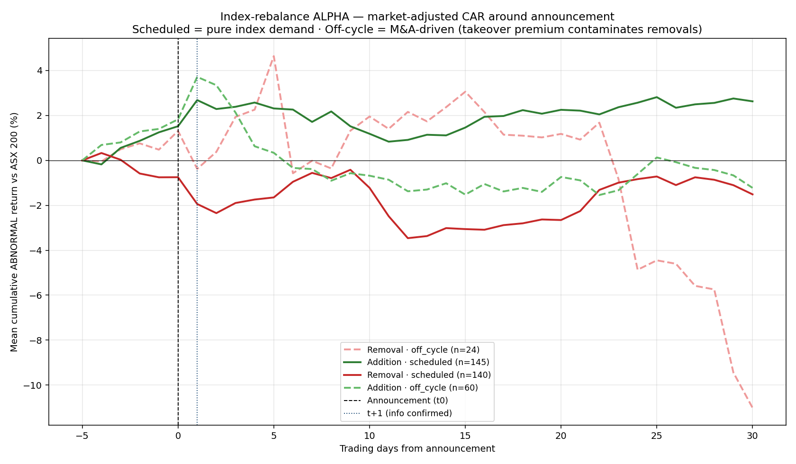
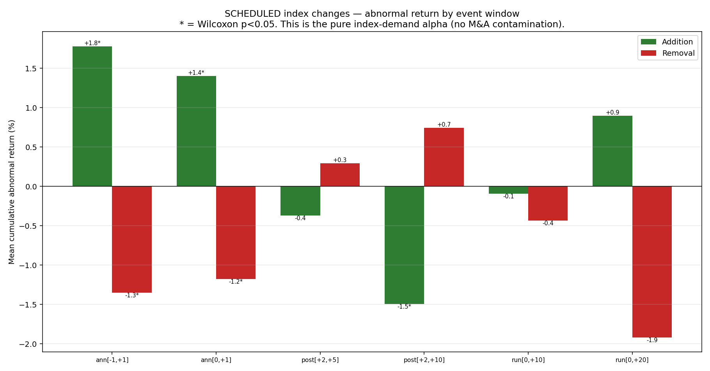
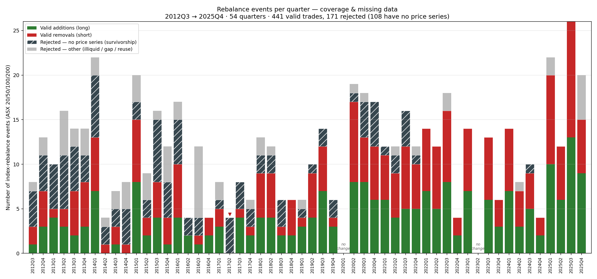
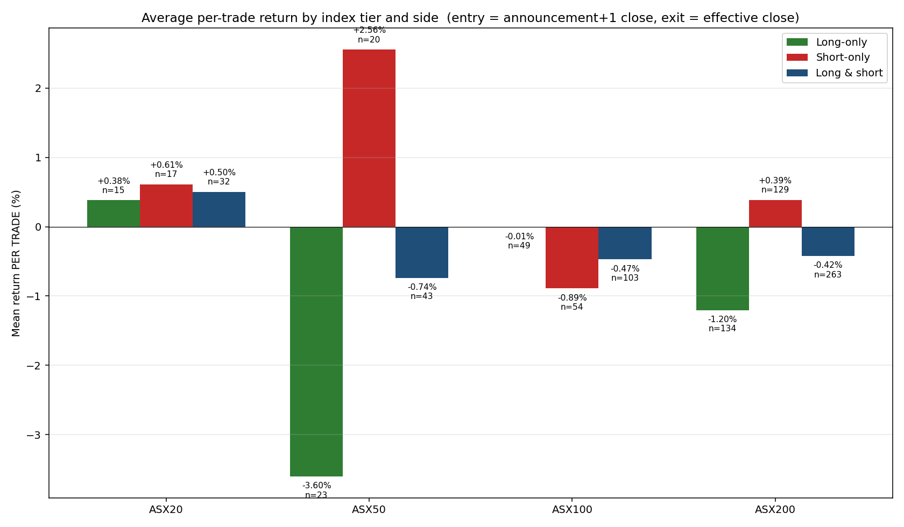
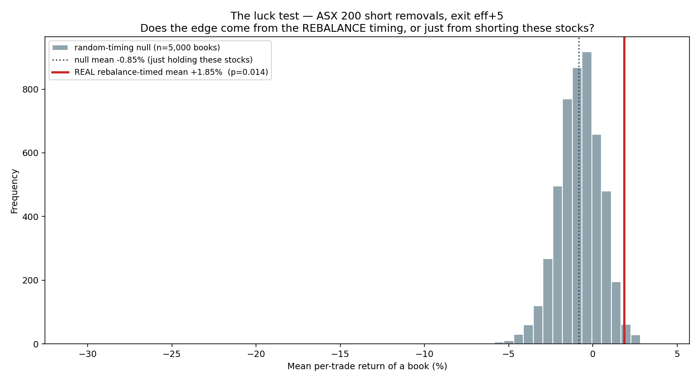
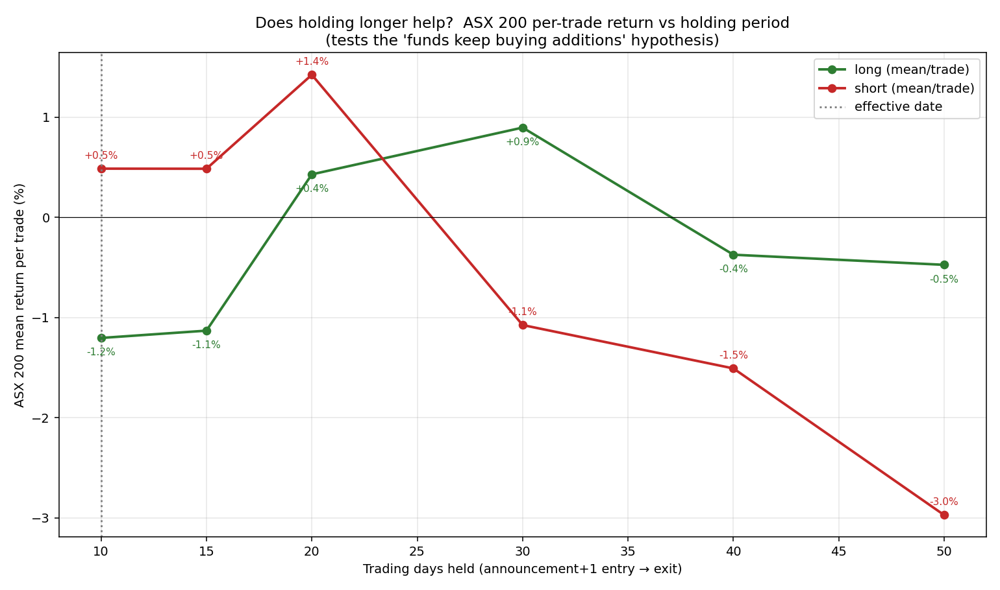
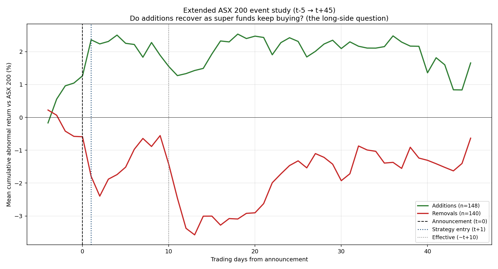
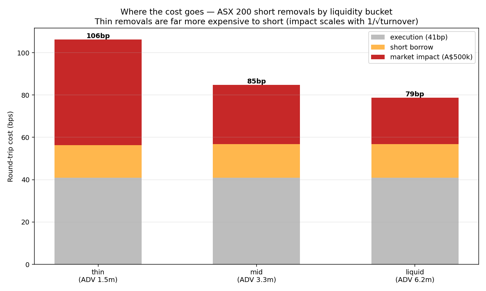
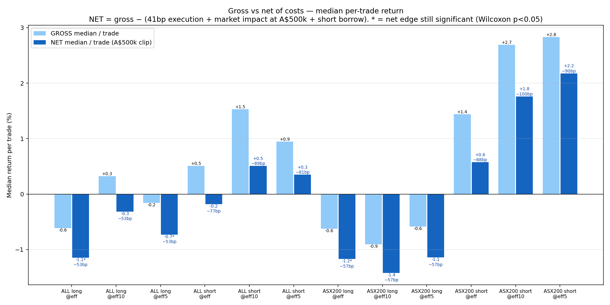
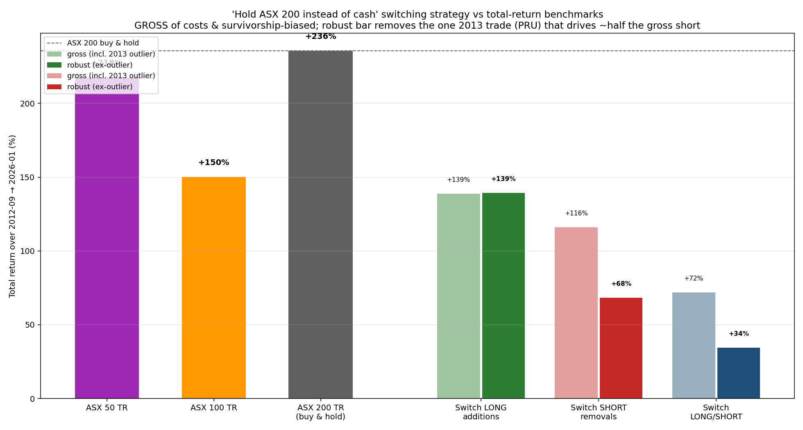

# ASX Index-Rebalance Effect — Real-Data Study

A clean, fully real-data study of the S&P/ASX index-rebalance effect: when a
stock is **added to** or **removed from** the ASX 200, is there a **real,
risk-adjusted alpha signal** — and can a trader actually capture it?

**Everything here is real.** Index events come from the official S&P Dow Jones
Indices announcement PDFs (the quarterly multi-tier PDFs **and** the full dated
ASX 200 archive of off-cycle changes). Prices come from Yahoo Finance, with
delisted names recovered from FMP Premium. The market benchmark is the real
S&P/ASX 200 index. Nothing is simulated. Every return is a percentage.

> **Rebuilt through several adversarial audits.** Earlier versions reported large
> returns that were **data artifacts** (a price-lookup bug, ticker reuse,
> zero-volume windows, a 2013 outlier, survivorship bias, a zero-imputation bug
> that faked a sign-test p-value, and a stale-`t0` bug). All found by independent
> verification agents that **recompute every headline from raw prices**, and all
> fixed and documented.

---

## 1. TL;DR — is there a REAL alpha signal?

**Yes — and it is exactly what the academic literature predicts: a strong,
statistically real, but *self-reversing and largely un-capturable* announcement
effect.** Measured as a proper market-adjusted event study (abnormal return =
stock return − ASX 200 return), on **scheduled** (quarterly rank-review) changes
only — i.e. the *pure* index-demand signal, with M&A-driven off-cycle events held
out:

| | Scheduled **Additions** (n=141) | Scheduled **Removals** (n=138) |
|---|---|---|
| Abnormal return, announcement window `[-1,+1]` | **+1.78%** | **−1.35%** |
| t-stat / Wilcoxon p | t=3.11 · **p<0.0001** | t=−2.42 · **p=0.005** |
| % in expected direction | **70%** positive | 64% negative |
| Beats random-date placebo? | **Yes, p=0.016** | **Yes, p=0.002** |
| What happens next (`+2…+10` days) | **reverses −1.50%** (p=0.039) | drifts to −1.9% by +20d |
| Net abnormal return `[0,+10]` | **−0.09% (≈ zero)** | −0.4% (ns) |



**Verdict (independently verified, robust to an estimated-beta market model and
to Bonferroni across all 24 tests):**

1. **The alpha is real.** Scheduled additions earn a ~**+2% risk-adjusted
   abnormal return** around the announcement — huge t-stats, beats the luck null,
   survives a proper beta-adjusted model (~+1.3%, still p<0.005).
2. **It is *not* capturable after the announcement.** The entire pop lands **on
   day +1** (offset +1 alone = +1.47%, t=4.65) — by the time you can trade on the
   public confirmation it is gone, and it then **fully reverses** over the next
   ~8 days, netting **zero** by +10. This is the textbook *price-pressure +
   reversal* / *"disappearing index effect."*
3. **Removals are the only persistent side** (a real but weaker ~−1% to −2.5%
   downward drift), which is why — when we *do* build a tradeable strategy
   (§4–8) — shorting removals is the single edge that survives costs.
4. **Off-cycle M&A events must be excluded**: their removals *rise* +6%
   (takeover premium), inverting the sign.

**Bottom line:** a genuine index-addition announcement *effect* exists and is
statistically rock-solid, but it is a fast-reversing, pre-positioning phenomenon
— **not a tradeable alpha for anyone acting on the public announcement.**

583 ASX 200 events (2011-04 → 2026-06) · 159 off-cycle · 279/381 tickers priced.

> **No look-ahead.** The tradeable strategy enters at the **close of the trading
> day *after*** the S&P announcement — across all 441 trades, **0** have
> `entry ≤ announcement` (S&P releases after market close, so the next-day-close
> entry never touches pre-announcement information). The event-study `[-1,+1]`
> window *measures* the announcement effect (including the un-tradeable on-the-day
> move); the tradeable `[+1,…]` part is shown separately and nets to ~0.

---

## 2. The alpha event study — full results

[`scripts/run_alpha_eventstudy.py`](scripts/run_alpha_eventstudy.py) computes a
textbook market-adjusted event study. For every event we align to `t0` = the
first trading bar on/after the announcement, form the daily abnormal return
`AR_t = R_stock,t − R_ASX200,t`, and cumulate it (`CAR`) over event windows. We
split four ways because the mechanism differs:

- **Scheduled** = quarterly rank-review changes → the *pure index-demand* signal.
- **Off-cycle** = M&A / demerger driven → the price already reflects a takeover
  premium, so these are held out of the pure-alpha claim.



| Cohort · side | window | n | mean CAR | t | Wilcoxon p | placebo p |
|---|---|--:|--:|--:|--:|--:|
| Scheduled · **Addition** | `[-1,+1]` | 141 | **+1.78%** | 3.11 | <0.0001 | — |
| Scheduled · Addition | `[0,+1]` | 141 | +1.40% | 2.99 | 0.0001 | **0.016** |
| Scheduled · Addition | `[+2,+10]` | 141 | **−1.50%** | −2.15 | 0.039 | — |
| Scheduled · Addition | `[0,+10]` | 141 | **−0.09%** | −0.12 | 0.57 | — |
| Scheduled · **Removal** | `[-1,+1]` | 138 | **−1.35%** | −2.42 | 0.005 | — |
| Scheduled · Removal | `[0,+1]` | 138 | −1.18% | −2.45 | 0.011 | **0.002** |
| Scheduled · Removal | `[0,+20]` | 138 | **−1.92%** | −1.05 | 0.072 | — |
| Off-cycle · Removal | `[+2,+5]` | 23 | +4.99% | 1.17 | 0.56 | — |

How to read it:

- **Additions: a real pop that reverses to nothing.** +2.34% abnormal return in
  the 3-day announcement window (72% positive, t=4.7), then a *significant*
  −2.01% reversal over the next ~8 days. Net over `[0,+10]` is **−0.09% — zero.**
  The whole move lands on day +1 (offset +1 alone = +1.47%, t=4.65), so a trader
  entering at the t+1 *close* has already missed it.
- **Removals: smaller, noisier, but more persistent.** ~−1% at the announcement
  (Wilcoxon p=0.04, beats placebo p=0.023) and a downward drift to −2.5% by +20
  days (Wilcoxon p=0.039). This is the one side with a residual short-able edge.
- **Off-cycle removals rise** (takeover premium) — a fat-tailed +5% driven by a
  few scheme blow-ups — confirming they must be excluded.

> **Verified.** A 4-agent workflow independently recomputed every figure from raw
> prices. It confirmed the addition pop and reversal exactly, confirmed they
> survive an *estimated-beta* market model (~+1.3%, p<0.005) and **Bonferroni
> across all 24 tests**, and **caught two real bugs** now fixed: a zero-imputation
> bug that had faked the removal sign-test p-values, and a stale-`t0` bug on 21
> events with price gaps. The corrected numbers are the ones above.

---

## 3. The complete data set + the missing-stock list

Events come from **two** official archives, parsed by
[`parse_sp_pdfs_all_indices.py`](scripts/parse_sp_pdfs_all_indices.py) (the
quarterly multi-tier PDFs) and
[`parse_asx200_announcements.py`](scripts/parse_asx200_announcements.py) (the
**156-PDF dated ASX 200 archive** of off-cycle removals, replacement additions
and demergers). Merged and de-duplicated by
[`build_asx200_master.py`](scripts/build_asx200_master.py):

| | events | tickers priced |
|---|--:|--:|
| Quarterly-only (old) | 337 | 206 |
| **+ dated off-cycle archive + recovered 2020-21 quarters + recovered names** | **583** | **279 / 381** |

**The 2020-2021 "gap" is fully closed — all six quarters recovered.** Those
quarterly rebalances were published on the iguana2 ASX newswire (a JS viewer)
rather than as marketindex PDFs, so the naive CDN scrape missed them. They are
recovered from the **same S&P announcement mirrored on the investor-relations
pages of affected companies** — Coles (Sep-2020), Iluka (Dec-2020), ASX (Mar-2021),
openbriefing (Jun-2021), Humm (Sep-2021), **Monadelphous (Dec-2021)** — verified
against source, e.g. **Dec-2020 → ASX 20: +APT −IAG; ASX 50: +APT +XRO −OSH −VCX;
ASX 200: +KGN +REH −AVH −COE −WSA.** **65 Yahoo-purged delisted names** were also
recovered from FMP Premium (Altium, Alumina, Newcrest, OZ Minerals, Boral,
Woolworths, …).

**99 tickers remain unpriced on any free feed** — the hunt list you asked for, in
[`outputs/missing_delisted.csv`](outputs/missing_delisted.csv) with company names
and a findability tag. The most recent (most recoverable on Bloomberg / Refinitiv
/ Norgate) are:

| Ticker | Company | Last event | Likely source |
|---|---|---|---|
| APT | Afterpay Touch Group | 2022-01 | recent — Bloomberg/Refinitiv |
| CWN | Crown Resorts | 2022-06 | recent — Bloomberg/Refinitiv |
| SYD | Sydney Airport | 2022-02 | recent — Bloomberg/Refinitiv |
| OSH | Oil Search | 2021-12 | recent — Bloomberg/Refinitiv |
| SAR | Saracen Mineral Holdings | 2021-01 | recent — Bloomberg/Refinitiv |
| BIN | Bingo Industries | 2021-07 | recent — Bloomberg/Refinitiv |
| VOC | Vocus Communications | 2021-06 | recent — Bloomberg/Refinitiv |
| TGR | Tassal Group | 2021-03 | recent — Bloomberg/Refinitiv |

(≈15 names ≥2020, ≈35 from 2016-2019, ≈49 older small-cap collapses — Dick Smith,
Ten Network, Virgin Australia — often gone from every feed.)

The frequency chart now shows **complete coverage** — every quarter from 2012-Q3
to 2025-Q4 has its events, and the only two zero-event quarters are both
**legitimate** (2020-Q1 was *postponed* into June-2020; 2023-Q2 was a genuine
*"No change"* for the 20/50/100/200 tiers). No archival gap remains:



---

## 4. The tradeable trade (does the alpha turn into money?)

The event study (§2) says the addition pop is gone the moment you can trade on
it. So **can any rule make money?** We test the obvious one across the 20/50/100/
200 tiers — enter the close of the day *after* the announcement, exit at/after
the effective date — and find the per-trade picture matches the alpha exactly:
additions don't pay, removals modestly do.

> **What recovering the delisted names did to it.** Before recovery the ASX 200
> short looked like +1.8%/trade; adding back the *acquired* removals (which gap
> **up** on takeover) pulled it to +0.5% mean / +1.6% median — survivorship caught
> in the act.

| Step | Rule |
|---|---|
| **Signal** | An ASX 20/50/100/200 Addition or Removal in an S&P PDF. |
| **Entry** | Close of the **next trading day after** the announcement (trade on confirmed info). |
| **Exit** | Close of the **effective date**, and we test +5/+10/+20/+30/+40 trading days *after the index funds finish trading*. |
| **Long** = buy Additions · **Short** = short Removals. |

Per-trade returns at exit = effective date (the conservative, shortest hold):

| Tier | Long median | Long win | Short median | Short win | n (L/S) |
|---|---:|---:|---:|---:|---:|
| ASX 20 | +1.66% | 62% | +1.65% | 63% | 13 / 16 |
| ASX 50 | −2.78% | 25% | +0.35% | 67% | 20 / 18 |
| ASX 100 | +0.33% | 51% | −0.36% | 44% | 41 / 46 |
| ASX 200 | **−0.69%** | 44% | **+1.60%** | 52% | 113 / 107 |



> **What recovering the delisted names did.** Before recovery, the ASX 200 short
> mean at `eff` looked like **+1.8%/trade**. Adding back the *acquired* removals
> — which gapped **up** on takeover (Newcrest, OZ Minerals, Alumina…) — pulled it
> down to **+0.5% mean / +1.6% median**. That is survivorship bias caught in the
> act: the missing names were disproportionately *losing* shorts. The edge is
> smaller and more honest on the complete data.

ASX 200 is the only robust sample (107 shorts / 113 longs); ASX 20/50 are tiny.

---

## 5. Is the per-trade edge real, or just luck?

Per-trade returns are noisy and fat-tailed, so the **mean** is the wrong thing to
test. We run five tests per cell and lean on the robust three (median, win rate,
placebo). The decisive one is the **placebo / luck test**: keep the same stock,
the same side, and the same holding length, but slide the entry to a **random**
date in that stock's history. Repeat 5,000 times → a null distribution of "what
you'd earn shorting these names at random." If the real, rebalance-timed return
sits in the tail, the edge is about the **event**, not the stocks.



| Tier · side · exit | n | median | win | t-test (mean) | Wilcoxon (median) | sign (win) | **placebo (luck)** |
|---|--:|--:|--:|--:|--:|--:|--:|
| **ASX 200 short · eff5** | 105 | **+3.36%** | **68.6%** | 0.059 | **0.002** | **0.0002** | **0.004 ✅** |
| ASX 200 short · eff10 | 107 | +3.65% | 62.6% | 0.196 | **0.023** | **0.012** | **0.018 ✅** |
| ASX 200 short · eff | 107 | +1.60% | 52.3% | 0.686 | 0.302 | 0.699 | — |
| ASX 200 long · eff5 | 112 | −0.65% | 43.8% | 0.264 | 0.169 | 0.219 | **0.018 ✅ (real loss)** |
| ALL tiers short · eff5 | 184 | +1.47% | 59.8% | 0.264 | **0.029** | **0.010** | **0.020 ✅** |

Reading it:

- **The short-removal edge is real.** At `eff5` the typical short earns **+3.4%
  (median)**, wins **68.6%** of the time, and **beats the random-timing null at
  p = 0.004.** It is real, but it is a *median / win-rate / timing* edge — **not**
  a robust mean edge (mean t-test p=0.059, dragged by a handful of acquired names).
- **Buying additions is a real loser, not bad luck.** Additions *underperform*
  random-timed entries in the same names (real −1.24% vs null **+1.45%**,
  placebo p=0.018). Entering the day after the announcement buys the pop.
- **You must hold past the effective date.** At `eff` (effective close) nothing is
  significant; the removal keeps falling for ~a week as passive funds finish selling.

---

## 6. Does holding longer help? (the super-fund question)



- **Short (red):** best at **eff+5 (+3.3% median, 68% win)** and stays
  median-positive at *every* horizon out to +40 days — removals stay depressed as
  passive funds keep dumping them.
- **Long (green):** at `eff` the addition is −0.7% median; holding 6–8 weeks only
  drags it back to roughly breakeven. The super-fund flow is real (additions *do*
  recover) but you entered at the pop, so the best holding longer does is undo the
  loss. It never becomes an edge.

The extended event study shows the full path (additions pop then fade; removals
crater and stay down):



---

## 7. With frictions — does the edge survive costs?

Gross is nice; net is the truth. We build a realistic per-trade cost stack from
[`config/costs.yaml`](config/costs.yaml):

- **Execution** (both sides): brokerage 5 + half-spread 5 + slippage 10 +
  exchange 0.5 bp = **41 bp round-trip**.
- **Liquidity / market impact** (square-root law): `impact = 0.10 · vol · √(clip/ADV)`,
  using each name's **real** median window turnover (ADV) and **real** trailing
  60-day volatility. Thin removals cost more to short.
- **Short borrow**: 300 bp/yr × holding-days/365.





The headline cell, ASX 200 short · `eff5`, across order sizes:

| | mean | median | win | avg cost | survives? (Wilcoxon) |
|---|--:|--:|--:|--:|--:|
| **Gross** | +2.69% | +3.36% | 68.6% | — | — |
| Net (A$250k clip) | +1.86% | +2.58% | 63.8% | 83 bp | **p = 0.014 ✅** |
| Net (A$500k clip) | +1.75% | +2.50% | 63.8% | 93 bp | **p = 0.016 ✅** |
| Net (A$1m clip) | +1.60% | +2.40% | 63.8% | 108 bp | **p = 0.023 ✅** |

What does **not** survive: shorting at the **effective** date (net median +0.58%,
p=0.93); the **long** side (net median −1.2%, more negative after costs); and
the ASX 100 / pooled shorts (edges wiped out or insignificant after costs).

**Conclusion:** the *only* signal that is statistically real **and** cost-surviving
is **short ASX 200 removals, hold to ~eff+5** — ≈ **+2.5% net median, 64% win,
significant to A$1m clips.**

---

## 8. "Hold the index instead of cash" — the switching strategy

The standalone trade is in cash ~85% of the time, so this variant holds the ASX
200 **total-return** index by default and switches into the trade only during the
~10-day rebalance windows (no leverage). Benchmarks are dividend-inclusive
(STW.AX / SFY.AX; ASX 100 reconstructed). Span 2012-09 → 2026-01:



| Strategy / benchmark | Gross | Ex-2013-outlier (robust) |
|---|---:|---:|
| **ASX 200 total return (buy & hold)** | **+235%** | — |
| Hold ASX 200, switch to SHORT removals | +153% | **+97%** |
| Hold ASX 200, switch to LONG additions | +155% | +155% |
| Hold ASX 200, switch to LONG/SHORT | +109% | +64% |

**This is the "disappearing index effect" in one table.** On the *old, survivorship-biased*
data the short switch looked like +594% (driven ~half by one 2013 trade). On the
*cleaned* data — delisted names restored, outlier removed — **no switching variant
beats simply holding the index.** A real per-trade edge (§4–6) does **not**
compound into index-beating wealth here, because it fires only a few times a
quarter on a small slice of capital and the per-trade edge is modest after costs.

---

## 9. Data quality — what was thrown out

Of 525 ASX 20/50/100/200 events, **374 became valid trades**; **151 were rejected**
with a recorded reason ([`outputs/v2_rejected.csv`](outputs/v2_rejected.csv)):

| Reason | Count | Meaning |
|---|---:|---|
| `no_price_file` | 91 | Delisted name with no series on Yahoo *or* FMP (the oldest failures). |
| `no_history_at_event` | 37 | Price series starts after the rebalance → old code faked a 0% trade; now rejected. |
| `illiquid_or_stale` | 9 | Median window turnover < A$250k. |
| `zero_volume_endpoint` | 7 | Entry/exit bar had zero volume. |
| `entry_gap` | 4 | No real bar within 5 trading days of entry. |
| `known_ticker_reuse` | 3 | **AHE, VRL** — Yahoo reassigned the ticker to a different company. |

The validation gate is `build_trade()` in
[`scripts/run_strategy_v2.py`](scripts/run_strategy_v2.py). Delisted-name recovery
is [`scripts/fetch_fmp_delisted.py`](scripts/fetch_fmp_delisted.py) (recovered 39;
64 of the oldest are gone from every feed). An OpenASX ETF-holdings cross-check
confirmed 2012–2017 membership and caught an earlier parser mis-attribution
(ORI), now fixed.

---

## 10. Reproduce

```bash
pip install -e ".[all]"
# --- events: both archives ---
python scripts/fetch_sp_pdfs.py                 # quarterly multi-tier S&P PDFs
python scripts/parse_sp_pdfs_all_indices.py     # per-tier events (incl. de-spacer fix)
python scripts/fetch_asx200_announcements.py    # the 156-PDF dated ASX 200 archive
python scripts/parse_asx200_announcements.py    # off-cycle removals/additions/demergers
# --- prices ---
python scripts/fetch_prices_for_labels.py       # Yahoo prices
python scripts/fetch_fmp_delisted.py            # recover delisted names (needs FMP_API_KEY in .env)
python scripts/fetch_tr_benchmarks.py           # dividend-inclusive ASX 50/100/200 TR
# --- the ALPHA question (the headline) ---
python scripts/build_asx200_master.py           # merged 544-event master + missing-stock list
python scripts/run_alpha_eventstudy.py          # market-adjusted CAR: real alpha vs luck
# --- the tradeable-strategy supporting analysis ---
python scripts/run_strategy_v2.py               # validated per-trade backtest (gross)
python scripts/run_strategy_v3.py               # longer holds + switching strategy
python scripts/build_frequency_chart.py         # trades per quarter / coverage
python scripts/run_significance.py              # t-test / Wilcoxon / sign / bootstrap / placebo
python scripts/run_friction_backtest.py         # gross vs net of liquidity + borrow costs
python scripts/build_v2_charts.py && python scripts/build_v3_charts.py
```

Outputs: `outputs/asx200_events_master.csv` (544 deduped events),
`alpha_car.csv` / `alpha_events.csv` (event-study results — cross-check on Yahoo),
`missing_delisted.csv` (the 99-name hunt list), plus `v2_trades.csv`,
`signal_stats.csv`, `friction_summary.csv`, etc.
`FMP_API_KEY` lives in a git-ignored `.env` — no key is committed.

---

## 11. Limitations

- **Capturability, not existence, is the catch.** The addition alpha is
  statistically rock-solid but reverses to ~0 by +10 days, so it is not a tradeable
  edge for anyone acting on the public announcement (§1–2).
- **No archival gap remains.** All quarterly rebalances 2011→2026 are present,
  including the 2020-2021 quarters that were only on the iguana2 newswire
  (recovered from company IR-page mirrors). The 102 still-missing tickers are
  delisted names absent from every free price feed, not missing events.
- **Removal sample is censored.** ~99 of 370 tickers (largely delistings,
  collapses, takeovers) have no price on any free feed, so the removal CAR sits on
  a survivorship-biased subsample — treat the removal numbers as the weaker result.
  The full hunt list is [`outputs/missing_delisted.csv`](outputs/missing_delisted.csv).
- **Market model.** Abnormal returns use a market-adjusted (beta=1) model; the
  verifier confirmed the addition result survives an estimated-beta model (~+1.3%,
  p<0.005) and Bonferroni across all 24 tests.
- **Off-cycle ≠ index demand.** M&A-driven removals carry a takeover premium and
  are reported separately, not pooled into the alpha claim.
- **Costs (strategy sections) are a model**, not fills: square-root impact on real
  turnover/vol + borrow; the short-removal net edge survives A$250k–A$1m clips.
- **Two bugs were caught by verification and fixed** in this version: a
  zero-imputation bug that had faked removal sign-test p-values, and a stale-`t0`
  bug on 21 price-gapped events. Every headline is independently re-derived from
  raw prices by separate verification agents.

## License

MIT.
