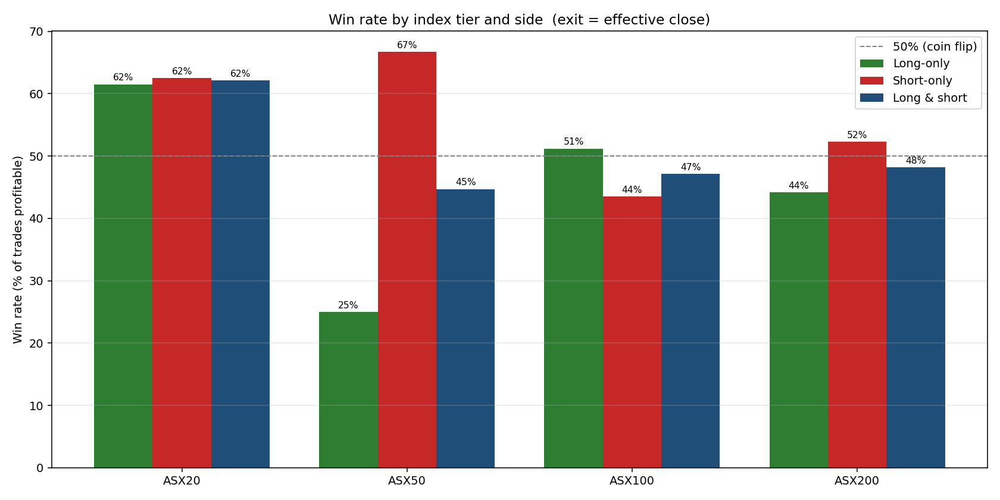

# ASX Index-Rebalance Effect — Real-Data Study

A clean, fully real-data study of the S&P/ASX index-rebalance effect: when a
stock is **added to** or **removed from** the ASX 20 / 50 / 100 / 200, does
trading around the change make money — and what's the best way to hold it?

**Everything here is real.** Rebalance events come from the official S&P Dow
Jones Indices announcement PDFs. Prices come from Yahoo Finance. Benchmarks are
the real S&P/ASX 50, 100, 200 indices — including a **dividend-inclusive
total-return** version. Nothing is simulated. Every return is a percentage.

> **The repo was rebuilt after an adversarial audit.** Earlier versions
> reported large positive returns that were **data artifacts**. A multi-agent
> verification pass found a price-lookup bug fabricating 33 fake 0% trades,
> Yahoo ticker-reuse serving the wrong company, frozen zero-volume windows, and
> a PDF-parser mis-attribution. All fixed and documented in
> [§6](#6-data-quality--what-was-thrown-out).

---

## 1. TL;DR

Rule: **buy additions / short removals at the close of the day *after* the
announcement; exit after the index funds have finished buying** (effective
date, and we test holding longer). 314 valid trades, 43 quarterly rebalances,
Sep-2012 → Dec-2025.


1. **Shorting removals works; buying additions (at announcement+1) does not.**
   ASX 200 removals fall ~1.8% by the effective date and keep falling — shorting
   them returns **+1.8%/trade** at effective, **+4.5%/trade (70% win)** if you
   hold 5 days past effective. ASX 200 additions *lose* −1.1%/trade.
2. **Why the long side loses, and your "funds keep buying" intuition** — see
   [§4](#4-does-holding-longer-help-the-super-fund-question). The addition pop
   happens *on announcement day*; entering the next day buys the peak. Holding
   longer **does** let additions recover (super/index funds keep accumulating),
   but only back to roughly **breakeven** (+0.4%/trade by ~7 weeks), because you
   started at the top.
3. **"Hold ASX 200 instead of cash"** — the standalone strategy is in cash ~84%
   of the time, so this version holds the ASX 200 total-return index and
   switches into the trades during rebalance windows (no leverage). **Only the
   short-removal version robustly beats the index** (+297% vs +236% after
   removing one outlier trade); the long/short and long-only variants actually
   *lag* the index. See [§5](#5-hold-asx-200-instead-of-cash-the-switching-strategy)
   — the gross numbers are large but driven by one 2013 trade and are
   survivorship-biased.

The honest one-liner: **there is a real per-trade edge in shorting ASX 200
removals (median-positive at every horizon); there is no usable edge in buying
ASX 200 additions; and no variant reliably beats simply holding the index by a
wide margin once outliers and survivorship are accounted for.**

---

## 2. The data source — official S&P PDFs

Every rebalance event is parsed from the S&P Dow Jones Indices quarterly
announcement PDFs (53 PDFs, 2011-Q3 → 2025-Q4, in
[`data/raw/marketindex/multi/`](data/raw/marketindex/multi/)), one table per
index tier. [`scripts/parse_sp_pdfs_all_indices.py`](scripts/parse_sp_pdfs_all_indices.py)
extracts every Addition/Removal with its tier, ticker and effective date:

| Tier | Events parsed |
|---|---:|
| ASX 20 | 29 |
| ASX 50 | 41 |
| ASX 100 | 111 |
| ASX 200 | 326 |

> marketindex.com.au's announcements page just links to these same S&P PDFs, so
> it is **the** source, not an independent one. The genuine independent check is
> OpenASX (ETF-holdings snapshots); see §6.

---

## 3. The trade

| Step | Rule |
|---|---|
| **Signal** | An ASX 20/50/100/200 Addition or Removal in an S&P PDF. |
| **Entry** | Close of the **next trading day after** the announcement (so you trade on confirmed info, after the announcement). |
| **Exit** | Close of the **effective date** — and we test +5/+10/+20/+30/+40 trading days, i.e. *after the index funds have had to complete their buying/selling*. |
| **Long** | Buy the **Additions**. **Short** | Short the **Removals**. |

Per-trade returns and win rate at exit = effective close:

| Tier | Long mean | Long win | Short mean | Short win |
|---|---:|---:|---:|---:|
| ASX 20 | +1.27% | 67% | +2.22% | 64% |
| ASX 50 | −3.51% | 25% | +0.70% | 67% |
| ASX 100 | +0.50% | 49% | −0.78% | 43% |
| ASX 200 | **−1.15%** | 42% | **+1.83%** | 54% |



(ASX 200 is the robust sample at 181 trades; ASX 20/50 are small, ~26–35 trades.)

---

## 4. Does holding longer help? (the super-fund question)

You asked: *the super funds and index funds have to keep pouring money in — so
holding the additions longer should fix the long side.* The data says **you're
partly right.**


- **Long (green):** at the effective date the addition is −1.1%/trade; it dips
  to −1.8% a week later, then **recovers as funds keep buying**, reaching
  **+0.4%/trade (52% win) by ~50 trading days held.** So the super-fund flow is
  real — additions *do* drift back up after effective — but because you entered
  the day after announcement (at the +1.9% pop), the best holding longer does is
  drag you back to roughly breakeven. It fixes the loss; it doesn't create an
  edge.
- **Short (red):** best at **effective + 5 days (+4.5%/trade, 70% win)** — the
  removal keeps falling as passive funds dump it. The *mean* turns slightly
  negative if you hold to 50 days (−1.1%), but the **median short trade stays
  positive (+3.6%) at every horizon** — so the typical short is still profitable
  even held long; the negative mean is a couple of recovered names.

The extended event study shows the full path (t-5 → t+45):


Additions pop on t=0→t+1, decay to the effective date, then grind back up to
~+2% by t+36. Removals crater to −4.5% around t+12 and stay depressed for weeks.

**Practical read:** short removals and exit ~a week after effective; if you must
trade additions, hold ~6–7 weeks just to break even — not worth it on ASX 200.

---

## 5. "Hold ASX 200 instead of cash" — the switching strategy

The standalone strategy is in cash ~84% of the time. You asked for a version
that **holds the ASX 200 instead of cash** and switches into the long/short only
during the ~10-day rebalance windows. No leverage — you're either in the index
or in the trade, never both.

Benchmarks here are **dividend-inclusive total return** (ETF adjusted close:
STW.AX for ASX 200, SFY.AX for ASX 50; ASX 100 reconstructed). Over the strategy
span 2012-09 → 2026-01:


| Strategy / benchmark | Gross total return | Ex-outlier (robust) |
|---|---:|---:|
| ASX 50 total return | +218% | — |
| ASX 100 total return | +150% | — |
| **ASX 200 total return (buy & hold)** | **+236%** | — |
| Hold ASX 200, switch to LONG additions | +133% | +133% |
| **Hold ASX 200, switch to SHORT removals** | +594% | **+297%** |
| Hold ASX 200, switch to LONG/SHORT | +406% | +188% |

**This was the riskiest number in the study, so an independent agent re-derived
it from raw prices. Verdict: the arithmetic is exact and the construction is
clean, but the +594% gross short is NOT robust.** A *single* 2013 trade — PRU,
which fell 55.6% in a near-empty early book — accounts for **roughly half** of
it. Remove that one trade and:

- **Short-removal switch: +297%** — still beats buy-and-hold (+236%), but
  modestly, not 2.5×.
- **Long/short switch: +188%** and **long-only: +133%** — both now *lag*
  buy-and-hold. The long-side drag pulls the combined book below the index.

So the only variant that **robustly** beats holding the index is the
**short-removal switch**, and even that comes with two caveats:

1. **Gross of costs** (borrow ~3%/yr on the short, spread, slippage, impact).
2. **Survivorship.** 59 of 165 ASX 200 removal events (**36%**) are on tickers
   Yahoo no longer carries and are silently excluded. These are mostly failed
   small-caps that would likely have fallen further (which would *help* the
   short), but some were acquired and gapped *up* (losing shorts) — so the true
   number is genuinely untestable on a third of removals.

**Bottom line:** the robust evidence is the per-trade short edge in §3–4
(+1.8% to +4.5%/trade, 54–70% win, median-positive at every horizon). The
compounded switching total is real in direction but outlier- and
survivorship-sensitive in magnitude.

---

## 6. Data quality — what was thrown out

Of 507 ASX 20/50/100/200 events, **314 became valid trades**; **193 were
rejected** with a recorded reason ([`outputs/v2_rejected.csv`](outputs/v2_rejected.csv)):

| Reason | Count | Meaning |
|---|---:|---|
| `no_price_file` | 139 | Ticker delisted long ago; Yahoo has no series (survivorship). |
| `no_history_at_event` | 33 | **The fixed bug.** Yahoo history starts years after the rebalance; old code used the first available bar → fake 0% trade. Now rejected. |
| `illiquid_or_stale` | 8 | Median window turnover < A$250k — not an index-level series. |
| `zero_volume_endpoint` | 6 | Entry/exit bar had zero volume. |
| `entry_gap` | 4 | No real bar within 5 trading days of entry. |
| `known_ticker_reuse` | 3 | **AHE, VRL** — Yahoo reassigned the ticker to a different micro-cap. |

The validation gate is in [`scripts/run_strategy_v2.py`](scripts/run_strategy_v2.py)
(`build_trade()`). An independent OpenASX (ETF-holdings) cross-check confirmed
2012–2017 membership at 75–100% and caught one parser error: a Dec-2018 "All
Australian 50" removal of **ORI** mis-attributed to ASX 200 (now fixed via a
"No change" section guard).

**To recover the 139 delisted names** you need a paid feed (FMP Premium /
Bloomberg) — Yahoo has purged them and Stooq is CAPTCHA-blocked. Drop an
`FMP_API_KEY` in `.env` and re-run `scripts/fetch_prices_for_labels.py` to fill
them in (the loader already supports it).

---

## 7. Reproduce

```bash
pip install -e ".[all]"
python scripts/fetch_sp_pdfs.py               # official S&P PDFs
python scripts/parse_sp_pdfs_all_indices.py   # per-tier add/remove events
python scripts/fetch_prices_for_labels.py     # real Yahoo prices
python scripts/fetch_tr_benchmarks.py         # dividend-inclusive ASX 50/100/200 TR
python scripts/run_strategy_v2.py             # validated per-trade backtest
python scripts/run_strategy_v3.py             # longer holds + switching strategy
python scripts/build_v2_charts.py             # per-trade bars, win rate, event study
python scripts/build_v3_charts.py             # horizon, extended event study, switch vs TR
```

Outputs: [`outputs/v2_trades.csv`](outputs/) (every valid trade with prices —
cross-check on Yahoo), `v2_rejected.csv` (drops + reason), `v2_summary.csv`,
`v3_horizon.csv`, `v3_overlay.csv`, `v3_daily.csv`.

---

## 8. Limitations

- **Survivorship** (139 missing delisted names) likely **overstates the short
  edge** in §5 (acquired removals — losing shorts — are missing).
- **Gross of costs in the per-trade tables.** A 70%-win +4.5% short survives
  realistic borrow/spread; a +0.5% long does not.
- **Total-return benchmarks**: ASX 200/50 from ETF adjusted close (exact); ASX
  100 reconstructed (price index × ASX 200 dividend factor).
- **Sample size**: ASX 20/50 are small (26–35 trades); ASX 200 (181) is robust.
- **Universe**: this study trades only the ASX 20/50/100/200 tiers; the PDFs
  also contain ASX 300, All Technology and All Australian events (2,000+ rows)
  that are parsed but not traded here.
- The compounded/switching totals are **outlier- and sample-sensitive** (one
  2013 trade drives ~half the gross short); the per-trade mean/median/win-rate
  are the robust primary metrics. Every headline number in §4–5 was
  independently re-derived from raw prices by a separate verification agent.

## License

MIT.
