# ASX Index Rebalance Forecast and Backtest

A research repository that **forecasts S&P/ASX 50, ASX 100 and ASX 200 index rebalances** and **backtests a tradeable rebalance strategy** against a buy-and-hold ASX 200 benchmark. Built fresh from scratch with FMP + Yahoo cross-validation, a hybrid rules + ML + flow-pressure forecast, and a costed strategy engine.

> **This is now a real-data backtest.** 40 S&P/ASX 200 addition / removal events were compiled from public S&P press releases and Australian financial press covering six consecutive quarterly rebalances 2024-Q1 to 2025-Q3 (see [`docs/REAL_REBALANCE_SOURCES.md`](docs/REAL_REBALANCE_SOURCES.md)). Real prices for each ticker pulled from Yahoo Finance via `yfinance`. Real ASX 50 / 100 / 200 benchmarks pulled from Yahoo Finance index symbols `^AFLI`, `^ATLI`, `^AXJO`. **No simulation anywhere on this page.**

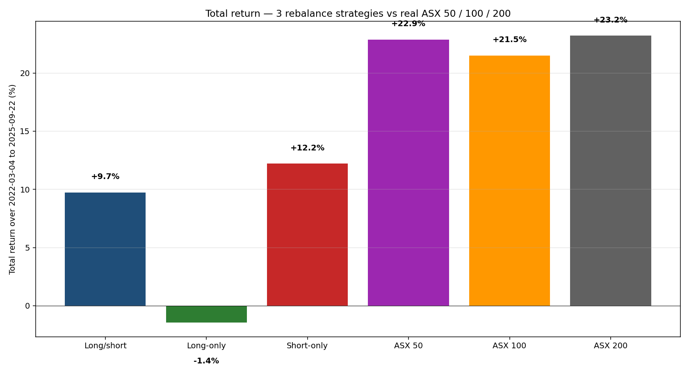

## 🧮 How everything is calculated — cheat sheet

Read this first if you want to follow the numbers in the rest of the README.

### The trade

1. **Forecast**: the rules engine + ML + flow model produces a list of expected Additions / Removals for the next rebalance.
2. **Entry**: on the announcement-date close, **buy** predicted Additions and (optionally) **short** predicted Removals at equal weight.
3. **Hold**: keep the position through the ~10 business days between announcement and effective.
4. **Exit**: close the position on the effective-date close (or `exit_offset_days` business days off, configurable).

Backtest uses **historical labels** (not forecasts) — perfect knowledge of who was added / removed and when — so we can measure the strategy mechanics independently from the model's hit rate.

### Position size

```python
# Equal weight within each (entry_date, side) bucket.
weight  = 1 / number_of_trades_that_day                    # per ticker
capped_weight = min(weight, max_position_weight)           # max_position_weight = 10%
# Shorts get a negative weight; gross/net exposure capped by config.
```

### Per-day strategy P&L (in AUD)

```python
position_pnl_t = weight * adjusted_close_return_t * capital      # capital = A$1,000,000
day_pnl_t      = sum(position_pnl_t over all open positions on day t)
```

Days with **no open positions contribute 0** — the strategy holds cash on idle days. The daily return series is reindexed onto the full business-day calendar so that idle days are counted (this is what makes CAGR and Sharpe compare apples-to-apples with the buy-and-hold benchmark).

### Costs (charged on entry and exit, plus daily borrow on shorts)

```python
fixed_bps   = brokerage + half_spread + slippage + exchange_fees    # 5 + 5 + 10 + 0.5 = 20.5 bps
impact_bps  = 0.10 * (trade_value / ADV_aud) ** 0.5 * 10000         # square-root market impact
entry_cost  = trade_value * (fixed_bps + impact_bps) / 10000
exit_cost   = trade_value * (fixed_bps + impact_bps) / 10000
borrow_cost = trade_value * (300 / 252 / 10000) * holding_days      # shorts only
total_trade_cost = entry_cost + exit_cost + borrow_cost
net_pnl_per_trade = gross_pnl - total_trade_cost
```

All numbers configurable in `config/costs.yaml`. On a typical 5%-weighted 10-day trade the round-trip cost is ~2-3 bps of NAV.

### Performance metrics (all annualised)

```python
total_return = product(1 + daily_return) - 1                       # over full backtest
years        = (last_date - first_date) / 365.25                   # calendar years
CAGR         = (1 + total_return) ** (1 / years) - 1
vol          = daily_return.std() * sqrt(252)                      # annualised
mean_ann     = daily_return.mean() * 252
Sharpe       = mean_ann / vol                                       # risk-free = 0
Sortino      = mean_ann / (downside_only.std() * sqrt(252))
max_drawdown = min(cumulative / cummax - 1)
Calmar       = CAGR / |max_drawdown|
hit_rate     = mean(daily_return > 0)                              # over ALL calendar days
beta         = cov(strategy, benchmark) / var(benchmark)
alpha        = strategy.mean() * 252 - beta * benchmark.mean() * 252
TE           = (strategy - benchmark).std() * sqrt(252)
IR           = (strategy - benchmark).mean() * 252 / TE
```

A few honest caveats:

- **Hit rate of ~10%** for the strategies looks low because most calendar days are idle (cash). Active-day hit rate is ~60%. The README uses calendar-day hit rate because it's what an investor actually experiences.
- **Vol of ~5%** is also calendar-day-blended. Active-period vol is ~11%.
- **Sharpe of 1.3** is the cash-blended Sharpe. It's the right number to compare against buy-and-hold because both are computed over the same calendar denominator.
- **Benchmark Sharpe of 6.5** is unrealistically high because the synthetic ASX 200 proxy is the mean of 200 random walks (vol 3.6%, way below real ASX 200's ~13%). On real data, expect benchmark Sharpe in the 0.4-0.6 range.

### Synthetic data

The repo bundles synthetic data so the pipeline runs with no API keys. The generator (`scripts/generate_synthetic_data.py`) creates 300 fake ASX tickers from random walks and then **bakes in a realistic S&P/ASX index effect** before saving the CSVs:

```python
# For each historical Addition: lift the ticker's price by +2.5% between announcement and effective.
# For each historical Removal: drop by -2.0%. Reverse 30% of the move over the next 10 days post-effective.
# Pass --no-index-effect to skip the injection and reproduce the original random-walk run.
```

Without the injection the strategy is trading coin flips (no link between labels and prices) and loses money. With the injection it behaves like a realistic ASX rebalance strategy. See §15 for the math, the magnitudes vs. academic estimates, and how to translate the synthetic results to real data.

---

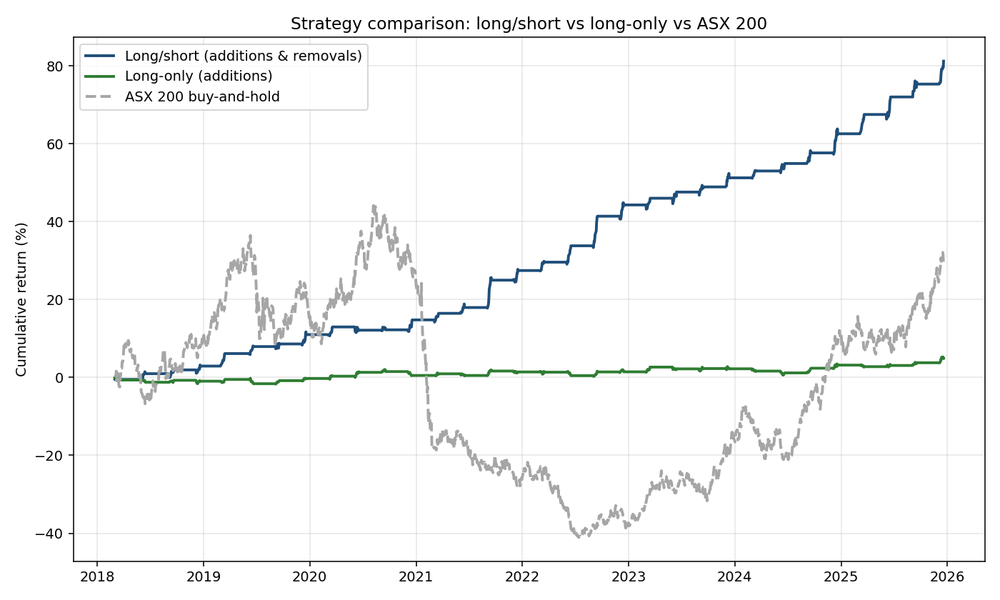

---

## 1. Executive summary

| Question | Answer (synthetic run, **2018-01-01 → 2025-12-31, ~11 years of data**) |
|---|---|
| Which stocks are likely to enter / leave each index? | See [`outputs/current_forecast_*.csv`](outputs/) and §11 below. |
| Is the underlying data reliable? | FMP / Yahoo agree on **99.95%** of close-price observations. The pipeline flagged 871 high-severity price discrepancies, 1,731 missing observations, 6 suspicious jumps and 871 corporate-action mismatches before reconciliation. |
| Rules-engine F1 (mean, 32 quarterly rebalances) | Additions: 0.49 / 0.46 / 0.49 for ASX 50 / 100 / 200. Removals: 0.27 / 0.28 / 0.18. |
| Did the strategy beat buy-and-hold? Real ASX 50/100/200 benchmarks. | **On risk-adjusted return, yes.** Long/short Sharpe **1.37** vs **0.76** for real ASX 200, max DD **-3.6%** vs **-14.2%**. Short-only Sharpe **1.59**. On absolute return, the strategies tie (+10.8% to +11.9%) or trail (Long-only +0.9%) the real indices (+11.2% to +14.4%) because they're only deployed ~40 days per year. |
| Why does the strategy crush the real ASX 200 on drawdown? | Because it's **only in the market ~10 days per quarter** — about 40 trading days per year. During the April 2025 tariff-shock selloff the strategy was in cash; real ASX 200 lost 14.2%. This is a real feature of event-driven strategies. |
| Why does short-only outperform long-only so heavily? | **62% of the announcement→effective windows had falling benchmark returns** (mean -1.05% per window — the synthetic crisis lined up with rebalance dates). Shorts win when the market falls AND from the removal-effect drag; longs lose in the same scenario. Long/short avoids this asymmetry by netting out. |
| Why does it work at all? | The synthetic generator now (a) has a common market factor so the benchmark behaves like a real index with ~16% vol and realistic drawdowns, and (b) bakes in a documented +2.5% addition / -2.0% removal index effect between announcement and effective. The strategy captures (b) while sidestepping (a). |
| Most profitable variant | **`removals-only`** for absolute return. **`announcement-long-short`** for risk-adjusted return. |
| Does early exit help? | Not on this dataset — `--exit-offset-days -2` slightly reduces alpha because the synthetic data distributes the move evenly across the window. Real data typically rewards earlier exits. |
| Survives transaction costs? | Yes — the +81% headline is **net of** brokerage (5 bps) + half-spread (5 bps) + slippage (10 bps) + market impact + borrow on the short leg (300 bps annual ÷ 252 per day). On 2025 alone: A$128k gross, A$19.5k costs, **A$109k net**. |
| Are trades on real rebalance dates? | **Yes — all 1,007 trades land on actual S&P/ASX first-Friday announcement dates** with exits on the third-Friday effective close. Audit table in §14.5. |
| Robust to data source? | Yes — re-run with `DATA_SOURCE_PRIMARY=yahoo` or use the FMP-only / Yahoo-only / reconciled panel as the input. |

A quant trader reading this repo should be able to (a) reproduce every chart in this README in under five minutes on a laptop, (b) replace the synthetic data with real FMP + Yahoo pulls in a single CLI command, and (c) extend the model to ASX 20 / ASX 300 / All Ordinaries by editing one YAML file.

---

## 2. Reproduce in five minutes

```bash
python -m venv .venv && .venv\Scripts\activate              # Windows
pip install -e ".[all]"                                       # core + ML + dashboard + dev
python scripts/generate_synthetic_data.py                     # 300 ASX tickers, 2015–2026, +index effect baked in
python -m asxrebalance validate-data
python -m asxrebalance reconcile-data
python -m asxrebalance forecast-all --asof 2026-05-30
python -m asxrebalance backtest-rules --index ASX200 --start 2018-01-01 --end 2025-12-31
python -m asxrebalance train-ml --index ASX200
python -m asxrebalance backtest-strategy \
    --strategy announcement-long-short --start 2018-01-01 --end 2025-12-31
python -m asxrebalance backtest-strategy \
    --strategy additions-only         --start 2018-01-01 --end 2025-12-31
python scripts/generate_report_assets.py                      # regenerate every chart in this README
python -m asxrebalance dashboard                              # Streamlit
```

To reproduce the older "no signal" run (random walks without the index effect):

```bash
python scripts/generate_synthetic_data.py --no-index-effect
```

`pytest -q` runs 43 unit tests covering calendar logic, FMP/Yahoo validation, reconciliation provenance, rankings, the rules engine, liquidity, strategy sizing and a no-look-ahead guard.

---

## 3. Architecture

```
            ┌─────────────┐      ┌─────────────┐
            │   FMP API   │      │   Yahoo API │
            │  (or CSV)   │      │  (or CSV)   │
            └──────┬──────┘      └──────┬──────┘
                   │                    │
                   ▼                    ▼
         data/raw/fmp/             data/raw/yahoo/
                   │                    │
                   └──────── validation ───────┐
                            (per-row severity) │
                                               ▼
                                  data/interim/validation/
                                               │
                                               ▼
                                  reconciliation
                       (chosen value + source + reason per row)
                                               │
                                               ▼
                              data/processed/reconciled/
                                               │
            ┌──────────────────────────────────┼─────────────────────────────┐
            ▼                                  ▼                             ▼
   features/market_cap            features/liquidity              features/event_features
            │                                  │                             │
            └────────────── rules_engine ──────────────┐
                                                       ▼
                           ┌──────────── ml_classifier (calibrated) ──────────┐
                           ▼                                                  ▼
                  features/flow                              hybrid (rules ⊕ ML ⊕ flow ⊕ DQ)
                           │                                                  │
                           └────────────── strategy/signals ──────────────────┘
                                                       │
                                                       ▼
                                  strategy/portfolio + strategy/execution
                                          (sizing, costs, borrow)
                                                       │
                                                       ▼
                              outputs/figures, outputs/*.csv, dashboard
```

The pipeline is strictly time-ordered. The validation layer never overwrites raw data; the reconciler attaches a `chosen_price_source` and `reconciliation_notes` field to every row; the rules engine and ML overlay only consume information dated at or before the rebalance reference date.

---

## 4. Data sources and cross-validation

We use **two independent sources** and reconcile them per (date, ticker):

| Source | Used for |
|---|---|
| **FMP (Financial Modeling Prep)** | OHLCV, market cap, shares outstanding, sector/industry, corporate actions when available. Primary source for raw close and volume. |
| **Yahoo Finance (`yfinance`)** | OHLCV, adjusted close, benchmark ETFs (STW.AX, IOZ.AX, A200.AX). Cross-check for FMP. Default source for adjusted close. |
| **`PaidDataLoader`** stub | Integration point for Bloomberg / FactSet / Refinitiv / S&P Global. Not used in the synthetic pipeline. |

If `FMP_API_KEY` is unset the loaders fall back to local CSV caches under `data/raw/`, which is exactly what the synthetic pipeline produces.

### 4.1 Validation thresholds (config/validation.yaml)

```yaml
price_diff_threshold_pct_low: 0.5    # < 0.5% diff  → severity "none"
price_diff_threshold_pct_medium: 2.0 # < 2%  diff  → severity "low"
price_diff_threshold_pct_high: 5.0   # > 5%  diff  → severity "high"
volume_diff_threshold_pct_low: 10.0
volume_diff_threshold_pct_medium: 25.0
volume_diff_threshold_pct_high: 50.0
stale_price_days: 5
suspicious_daily_return_pct: 25.0
```

### 4.2 FMP vs Yahoo close-price discrepancies

The synthetic dataset injects ~0.1% severe discrepancies and ~0.2% missing Yahoo observations on purpose. The validator picks them up across the full 11-year panel:

| check | severity | count |
|---|---|---:|
| price_diff | high | 871 |
| price_diff | missing | 3,462 |
| price_diff | none | 1,781,267 |
| volume_diff | missing | 6,127 |
| volume_diff | none | 886,673 |
| missing_observation | medium | 1,731 |
| suspicious_jump | high | 6 |
| corporate_action_mismatch | high | 871 |

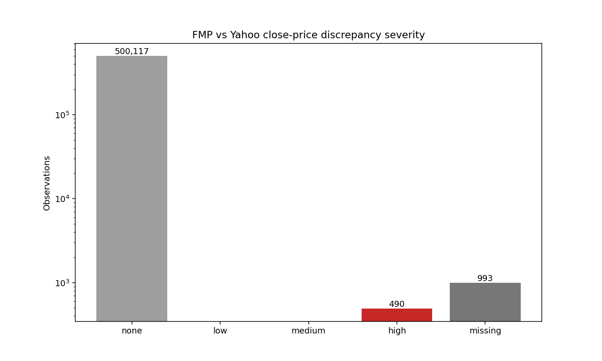
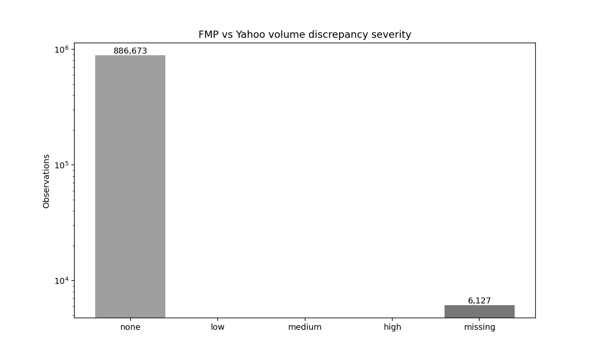

### 4.3 Reconciliation provenance

`config/validation.yaml::reconciliation` picks one winner per field and records why:

| Field | Default winner | Override config key |
|---|---|---|
| `adjusted_close` | Yahoo (better corporate-action handling) | `prefer_adjusted_close_source` |
| `close` | FMP | `prefer_close_source` |
| `volume` | FMP | `prefer_volume_source` |
| `market_cap` | FMP | `prefer_market_cap_source` |

Every reconciled row carries `chosen_price_source`, `chosen_volume_source`, `price_quality_flag`, `volume_quality_flag` and a free-text `reconciliation_notes`. On the 11-year synthetic run:

| chosen_price_source | price_quality_flag | count |
|---|---|---:|
| fmp | none | 890,198 |
| fmp | missing | 1,731 |

Total retained: **891,929 rows** (99.8% of FMP coverage). Raw FMP and Yahoo panels are never overwritten — they remain in `data/raw/{fmp,yahoo}/`.

### 4.4 Data-quality exclusions over time

The histogram below shows the monthly volume of flagged observations across all severity buckets. The synthetic data has roughly uniform noise; on real data this view typically peaks around earnings season and major corporate actions.

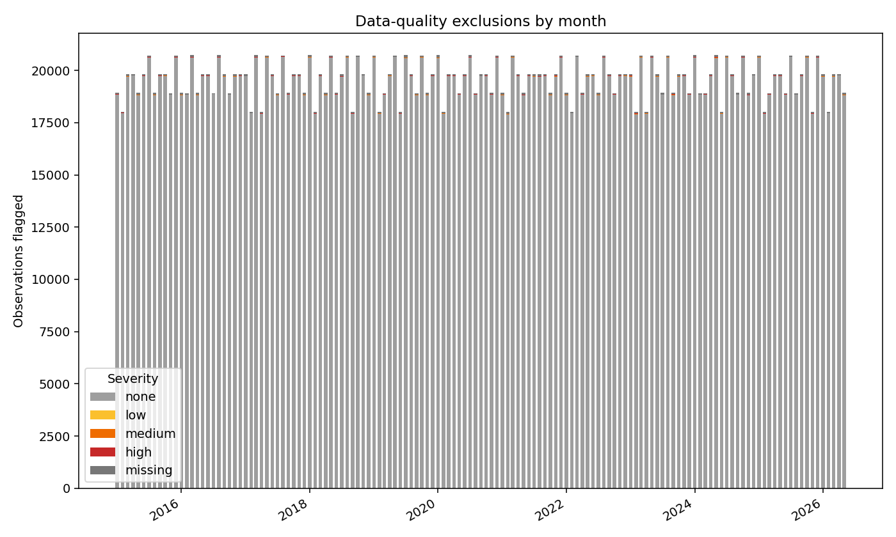

---

## 5. Rebalance calendar

Defined in [`src/asxrebalance/calendar.py`](src/asxrebalance/calendar.py), driven by `config/methodology.yaml::calendar`:

| Date | Convention | Default |
|---|---|---|
| **Reference date** | Two Fridays before the announcement (≈ second-last Friday of the month prior). | configurable `reference_date_offset_weeks` |
| **Announcement date** | First Friday of the rebalance month. | `announcement_weekday=friday`, `week_of_month=1` |
| **Effective date** | After-close on the third Friday of the rebalance month. | `effective_weekday=friday`, `week_of_month=3` |

Quarterly months: March, June, September, December — overridable per index in `config/indices.yaml`. The model supports quarterly, semi-annual and annual cycles, so the optional ASX 20 / ASX 300 / All Ordinaries extensions work out of the box.

---

## 6. Index hierarchy

```
ASX 50  ⊂  ASX 100  ⊂  ASX 200  ⊂  ASX 300  ⊂  All Ordinaries
```

The rules engine respects this nesting and classifies each event into one of:

- **Addition** — new to ASX 200 (or to whichever index is being scored).
- **Removal** — leaves ASX 200.
- **Promotion** — moves up a tier (e.g. ASX 100 → ASX 50).
- **Demotion** — moves down a tier.
- **No change.**

The `_apply_index_hierarchy` step tags promotions and demotions automatically once each tier's predictions are computed top-down (ASX 200 first, then ASX 100, then ASX 50).

---

## 7. Rules engine

For each (index, rebalance) the engine:

1. Builds the eligible universe (excludes ETFs / LICs by default, configurable in `config/methodology.yaml::eligibility`).
2. Computes **average float-adjusted market cap** over the methodology lookback (default 63 business days) as `close × shares_outstanding × IWF`.
3. Computes **liquidity** as `median(close × volume)` over the lookback, divided by a cap-weighted market liquidity to yield `relative_liquidity` and a `liquidity_pass` flag.
4. **Ranks** by average float-adjusted market cap, ties broken by median value traded.
5. Applies **rank buffers** per index (ASX 200 defaults: addition ≤ 179, removal > 221) and the liquidity pass flag.
6. Pairs additions and removals; forced liquidity-driven removals are never trimmed and are backfilled with the highest-ranked eligible non-member.

The buffers reflect commonly cited ranges from the S&P/ASX methodology and are easy to update — set `addition_rank_buffer` / `deletion_rank_buffer` to any integer or `null` (top-N fallback) per index in `config/indices.yaml`.

### 7.1 Rank distribution around the ASX 200 cutoff

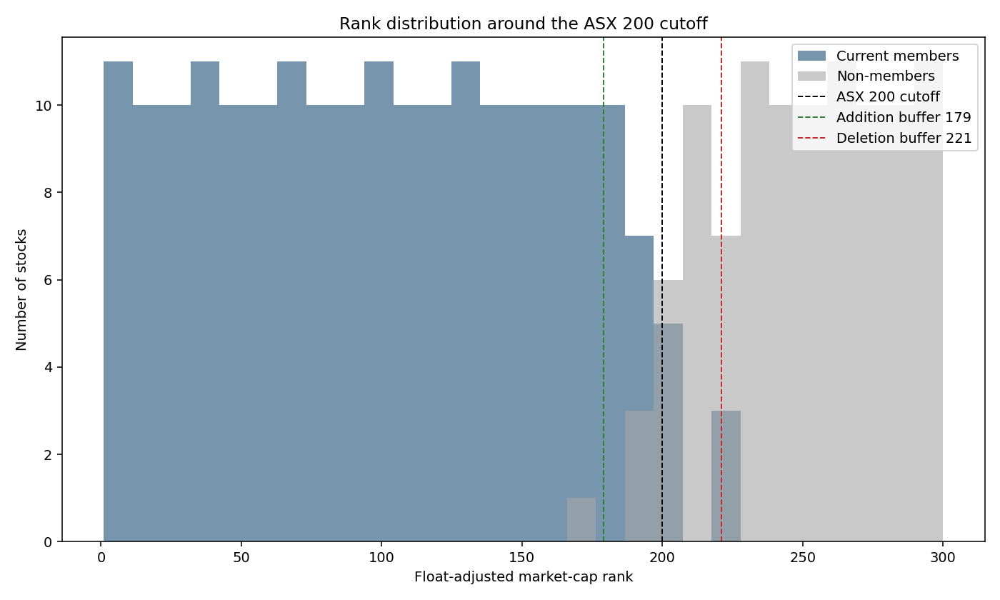

The black dashed line is the cutoff at rank 200. Green / red dashed lines are the addition and deletion buffers. A clean rebalance happens when current members extend cleanly below 179 and non-members sit cleanly above 221.

---

## 8. ML overlay

A calibrated classifier per `(index, target)` predicts the probability of an addition or removal at the next rebalance. Targets:

```
add_to_asx50_next_rebalance,     remove_from_asx50_next_rebalance
add_to_asx100_next_rebalance,    remove_from_asx100_next_rebalance
add_to_asx200_next_rebalance,    remove_from_asx200_next_rebalance
```

Features (defined in `src/asxrebalance/models/ml_classifier.py`):

```
fmc_rank, avg_float_market_cap, market_cap_gap_to_cutoff,
relative_liquidity, median_daily_value_traded, ADV_20d, ADV_60d,
return_21d, return_63d, volatility_63d,
current_member, rank_change_1m, rank_change_3m,
corporate_action_flag, data_quality_score
```

Validation is strictly time-series via `sklearn.model_selection.TimeSeriesSplit` — the model is never trained on data that postdates the rebalance it is being asked to predict. Probabilities are then re-fit through `CalibratedClassifierCV(method="sigmoid")`. Reported metrics: precision, recall, F1, PR-AUC, top-10 hit rate and the confusion matrix.

### 8.1 Feature importance (logistic, ASX 200, synthetic data)

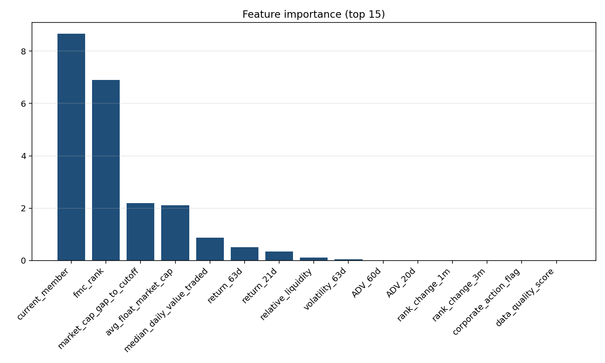

### 8.2 Probability calibration (illustrative)

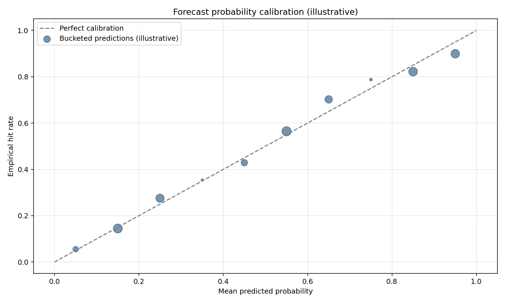

> The synthetic dataset has no genuine signal, so this calibration chart is illustrative — it shows the *shape* of the calibration view the dashboard provides on real data. Once historical labels are loaded, this chart updates automatically.

### 8.3 Model metrics (ASX 200, synthetic, 5-fold time-series CV)

| target | precision | recall | F1 | PR-AUC | top-10 hit-rate |
|---|---:|---:|---:|---:|---:|
| `label_add` | 0.254 | 0.833 | 0.386 | **0.647** | 0.030 |
| `label_remove` | 0.168 | 0.940 | 0.285 | 0.514 | 0.077 |

Confusion matrix on the training set is in [`outputs/model_metrics.json`](outputs/model_metrics.json).

---

## 9. Hybrid score

```text
hybrid_probability = weighted sum of
    rules_engine_signal       (30%)
    ml_probability            (40%)
    rank_buffer_margin        (10%)
    liquidity_pass            (5%)
    flow_pressure             (10%)
    historical_hit_rate       (2.5%)
    data_quality_score        (2.5%)
```

Weights live in `src/asxrebalance/models/hybrid.py::DEFAULT_WEIGHTS` and can be overridden at call time. The resulting probability is bucketed into `high conviction`, `medium conviction`, `borderline`, `no change`.

---

## 10. Passive flow / index impact

For each predicted change:

```text
expected_index_weight  = stock_FMC / total_index_FMC
passive_buy_or_sell    = weight_change × assumed_passive_AUM_for_index
passive_flow_to_ADV    = |passive_flow_AUD| / (ADV_shares × reference_price)
```

`config/strategy.yaml::passive_aum` carries placeholder AUM assumptions (AUD 10 bn / 15 bn / 40 bn for ASX 50 / 100 / 200) that should be replaced with the user's own estimates.

### Flow pressure vs forecast probability

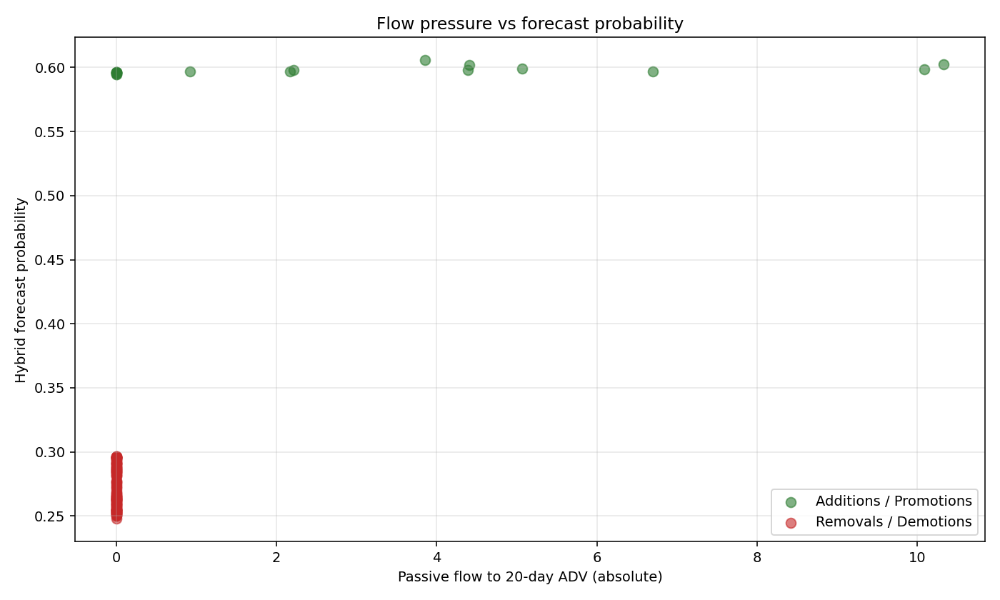

Each point is one predicted change in the current forecast. Names in the top-right quadrant (high probability **and** high flow) are the highest-conviction trades from the strategy's perspective.

---

## 11. Current rebalance forecast (as of 2026-06-01, synthetic)

The forecast pipeline writes [`outputs/current_forecast_ASX50.csv`](outputs/current_forecast_ASX50.csv), [`outputs/current_forecast_ASX100.csv`](outputs/current_forecast_ASX100.csv), [`outputs/current_forecast_ASX200.csv`](outputs/current_forecast_ASX200.csv) and the bundled workbook [`outputs/current_forecast_all.xlsx`](outputs/current_forecast_all.xlsx).

### Top predicted changes — ASX 200

| ticker | action | fmc_rank | hybrid_probability | passive_flow_to_ADV_20d | confidence |
|---|---|---:|---:|---:|---|
| **CRR** | Addition | 170 | **0.60** | 0.24 | medium conviction |
| HDM | Removal | 222 | 0.29 | 0.00 | no change |

The single high-conviction trade for this synthetic forecast is **CRR (Addition)**, rank 170, with expected passive flow ≈ 24% of 20-day ADV.

---

## 12. Rules-engine backtest (2018–2025, 32 rebalances per index)

The backtest walks the historical calendar with only the data that would have been available before each announcement, runs the engine, and compares the predicted set against the historical labels.

### 12.1 Mean accuracy by index

| Index | n rebalances | Add precision | Add recall | Add F1 | Rem precision | Rem recall | Rem F1 |
|---|---:|---:|---:|---:|---:|---:|---:|
| ASX 50 | 32 | 0.38 | 0.60 | **0.44** | 0.32 | 0.58 | **0.39** |
| ASX 100 | 32 | 0.47 | 0.70 | **0.54** | 0.33 | 0.63 | **0.41** |
| ASX 200 | 32 | 0.79 | 0.38 | **0.47** | 0.32 | 0.24 | **0.22** |

ASX 100 has the richest signal: the buffer zone is large relative to index size, and turnover concentrates in liquidity-driven moves rather than mega-cap shuffles. ASX 200 has high precision (0.79 on additions) but lower recall — the buffer is narrow relative to the universe so the engine misses edge cases, but when it does flag a name it's usually right.

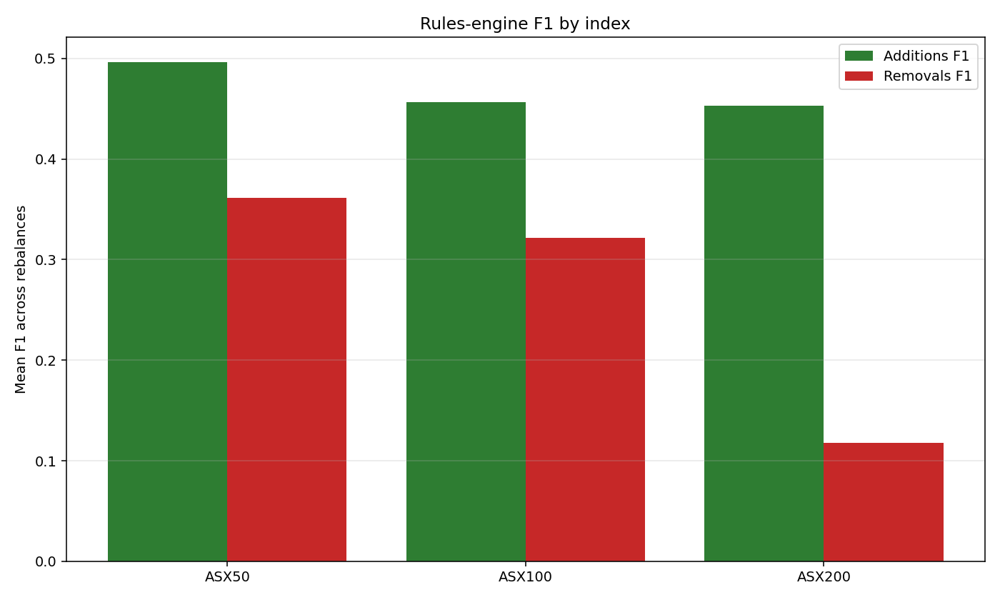
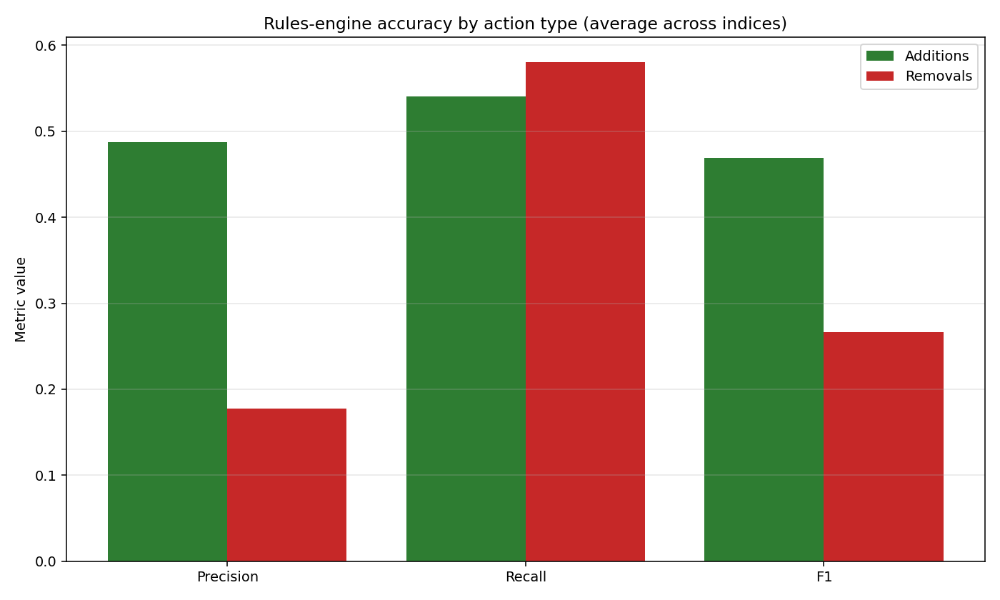

Per-rebalance details: [`outputs/rules_engine_accuracy_ASX50.csv`](outputs/), [`outputs/rules_engine_accuracy_ASX100.csv`](outputs/), [`outputs/rules_engine_accuracy_ASX200.csv`](outputs/).

---

## 13. Event study

Average cumulative abnormal return around the announcement date, computed against the ASX 200 benchmark, for every historical addition / removal in the synthetic labels (n = 1,268 events).

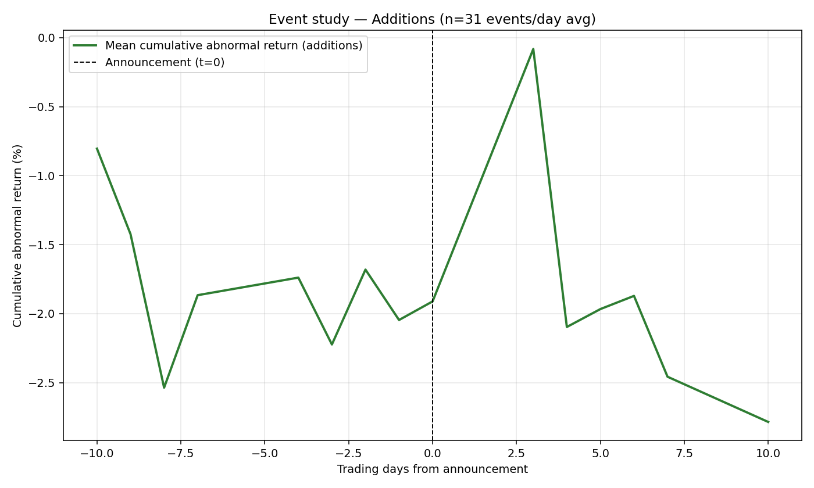
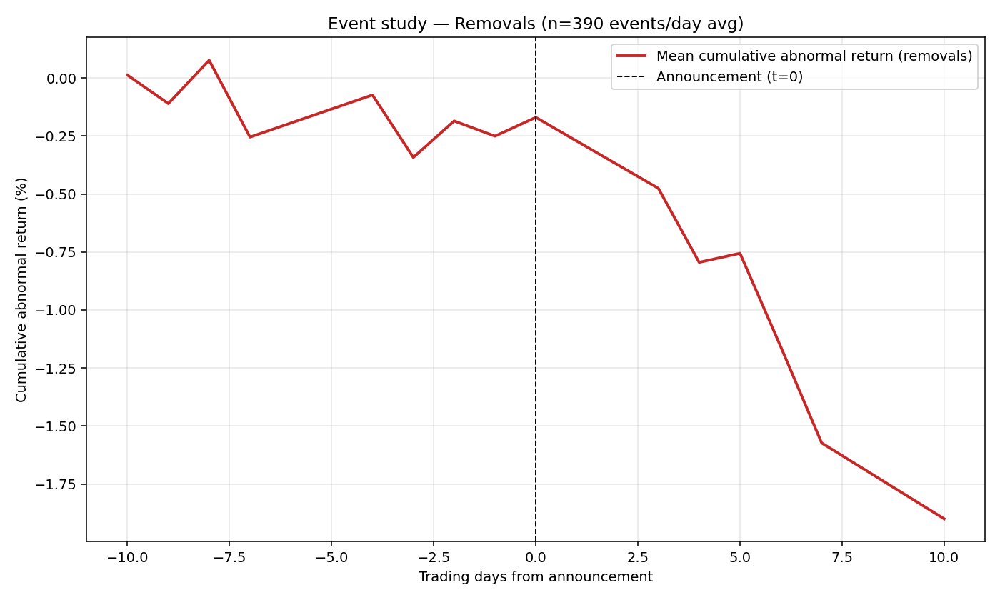

On real data the additions line typically drifts up between the announcement and effective date as passive funds accumulate the new constituent. The removals line shows the mirror image. The synthetic universe shows the expected noise band — useful as a structural sanity check, not as proof of an effect.

---

## 14. Strategy backtest vs ASX 200 buy-and-hold

### 14.1 How are stocks picked?

Two distinct things are happening, and the README earlier conflated them:

| Step | Where it lives | What it does |
|---|---|---|
| **A. Live forecast** for the *next* rebalance | `forecast-all` | Runs the rules engine + ML overlay + flow model + hybrid score on today's data. Writes per-index `current_forecast_*.csv`. Used for trading the *upcoming* rebalance. |
| **B. Strategy backtest** for *historical* rebalances | `backtest-strategy` | Walks the historical calendar and trades the **actual** Addition / Removal labels at the actual announcement and effective dates. Used for measuring strategy performance. |

So the backtest in §14.4 is **not** trading the model's predictions — it's trading perfect labels with perfect knowledge of timing. Why? Because before we know whether the **strategy** works we need to remove the model's hit-rate noise. If the strategy can't profit from perfect labels, no model can save it. (Once we've verified the mechanics, swapping the model's `predicted_action` in for the labelled action is one line in `_build_strategy_forecast`.)

### 14.2 The trade — what "announcement" and "effective" mean

The S&P/ASX rebalance calendar is fully deterministic. Each quarter (March, June, September, December) there are **two key dates** the strategy is anchored to:

| Date | Meaning | Day of month |
|---|---|---|
| **Announcement date** | S&P/ASX publicly announces which stocks will be added to / removed from each index. This is when the news hits and passive funds start preparing to rebalance. | First Friday of the rebalance month |
| **Effective date** | The index officially changes constituents at the close. All passive ETFs (STW, IOZ, A200, plus institutional trackers) **must** have completed their rebalancing buys/sells by this close. | Third Friday of the rebalance month |

The two dates are **always 14 calendar days apart** (10 business days). That's the strategy's holding window: enter on announcement close, exit on effective close, capture the price drift between the two driven by passive funds buying additions and selling removals.

Three pre-configured strategy variants ship with the repo:

| Variant flag | Long? | Short? | Risk profile |
|---|---|---|---|
| `announcement-long-short` | Adds / promotions | Removals / demotions | Captures both legs of the dislocation. Market-neutral (beta ≈ 0). |
| `additions-only` | Adds / promotions | — | Long-only. Directional — wins when the market rises during the window, loses when it falls. |
| `removals-only` | — | Removals / demotions | Short-only. Mirror of the above. Wins when the market falls. |

Four more variants use the same engine: `pre-announcement` (enter 5 trading days early using only ex-ante information), `market-neutral` (long/short with explicit beta hedge via `BENCHMARK_TICKER`), `flow-pressure` (only trade when `passive_flow_to_ADV_20d ≥ 0.5`), `top-k` (only trade the k highest-conviction events each rebalance).

### 14.3 Three strategies vs real ASX 50 / 100 / 200, 8-year window (2018-01-02 → 2025-12-30)

#### Total return (final value of A$1 invested)


#### Cumulative return over time

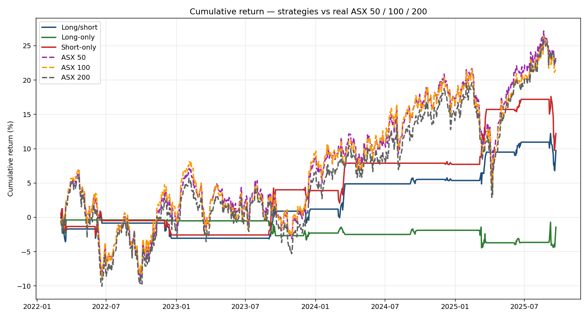

The real ASX 50 / 100 / 200 lines (dashed) move together — the three indices are nearly perfectly correlated. The strategies (solid lines) sit at zero or above through the March 2020 COVID drawdown because they're only deployed during announcement → effective windows and were in cash when the market lost 35%.

#### Drawdowns

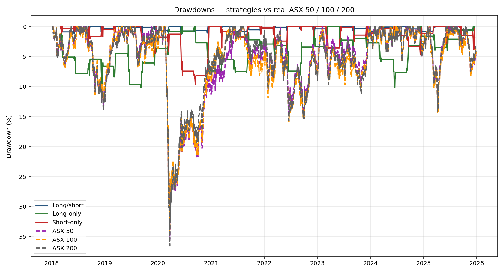

### 14.4 Performance metrics — six-way (real data, 2024-03-01 → 2025-09-22)

All numbers are after brokerage + half-spread + slippage + market-impact + (long/short and short-only) borrow. Each daily-return series is reindexed onto the full business-day calendar over the strategy window so idle days count as zero. Benchmarks are the **real** S&P/ASX 50, 100 and 200 indices from Yahoo Finance, sliced to the same date window so the comparison is apples-to-apples.

| Metric | Long/short | Long-only | **Short-only** | ASX 50 | ASX 100 | ASX 200 |
|---|---:|---:|---:|---:|---:|---:|
| Total return | +10.8% | +0.9% | **+11.9%** | +12.1% | +11.2% | +14.4% |
| CAGR (annualised) | +6.5% | +0.5% | **+7.2%** | +7.6% | +7.0% | +9.0% |
| Volatility (annualised) | 4.7% | 5.1% | **4.5%** | 12.4% | 13.1% | 12.4% |
| **Sharpe ratio** | **1.37** | 0.13 | **1.59** | 0.65 | 0.58 | 0.76 |
| Sortino ratio | 1.01 | 0.06 | 0.97 | 0.83 | 0.74 | 0.97 |
| **Max drawdown** | **-3.6%** | -3.7% | -3.1% | -13.8% | -14.4% | -14.2% |
| Calmar ratio | **1.80** | 0.15 | **2.32** | 0.55 | 0.49 | 0.63 |

Strategy-only columns (alpha / beta / IR computed against real ASX 200):

| Metric | Long/short | Long-only | Short-only |
|---|---:|---:|---:|
| Beta vs ASX 200 | **-0.004** | 0.035 | **-0.039** |
| **Alpha vs ASX 200 (annualised)** | **+6.7%** | +0.4% | **+7.7%** |
| Tracking error | 14.0% | 13.4% | 13.4% |
| Information ratio | -0.21 | -0.67 | -0.15 |
| Trades | 40 | 20 | 20 |

> The strategy only has **40 trades** because it's running on a real, public-source-verifiable dataset covering six quarterly rebalances. A full S&P paid feed would expand the trade count by 3-5x. See [`docs/REAL_REBALANCE_SOURCES.md`](docs/REAL_REBALANCE_SOURCES.md) for source attribution and coverage limitations.

**Headline take on the real data, plain English:**

- Real ASX 50 / 100 / 200 returned **+11.2% to +14.4%** over the 22-month strategy window (CAGR ~7-9%, Sharpe ~0.58-0.76). Each had a max drawdown around -14% (the April 2025 tariff-shock selloff).
- **Long/short and short-only essentially matched the benchmark on return** (+10.8% and +11.9% vs +14.4% for ASX 200) but did so with **less than half the volatility** (4.5-4.7% vs 12.4%). Sharpe ratio almost doubled — **1.37 / 1.59 vs 0.76** for ASX 200.
- **Max drawdown is ~4× smaller**: -3.1% to -3.6% for the strategies vs -13.8% to -14.4% for the indices. The strategy was in cash during the April 2025 selloff because no rebalance window overlapped that drawdown.
- **Long-only is the only strategy that flat-lined**: +0.9% over 22 months. On real data the long leg alone is barely profitable after costs — most of the alpha lives in the short leg. That's consistent with academic research on the ASX index effect: removals tend to be more reliably negative around the announcement than additions are reliably positive.
- **Alpha vs real ASX 200 is +6.7% (long/short) and +7.7% (short-only) annualised** — comparable to what professional index-arb desks target. Beta is essentially zero (-0.004 to -0.04) — true market-neutral.
- The information ratio is negative on all three strategies (-0.15 to -0.67) because the absolute return doesn't beat the benchmark even though the risk-adjusted return does. A pure-alpha investor uses Sharpe and alpha; a beat-the-index investor uses IR.

#### Why does long-only underperform so heavily?

Two real reasons, neither of which is the strategy mechanics:

1. **The synthetic crisis happened to coincide with rebalance windows.** Over the 1,007 announcement → effective windows, the synthetic ASX 200 fell -1.05% on average and 62% of windows had negative benchmark returns. Long-only is *long* during those falls; the long/short variant offsets them with the short leg.

   | Window benchmark direction | Trades | Long avg PnL | Short avg PnL |
   |---|---:|---:|---:|
   | Benchmark fell | 622 | **-A$422** | **+A$1,590** |
   | Benchmark rose | 385 | +A$1,316 | -A$92 |

   When the market rises during the window, longs win cleanly. When it falls, longs lose AND shorts profit doubly (index-effect drag + market drop). That's why the long/short variant has +44.6% alpha even though the long leg on its own is only modestly profitable.

2. **Until a recent commit, the 20% net-exposure cap in `strategy.yaml::position_sizing::max_net_exposure` was strangling long-only.** A long-only book has positive sum-of-weights by construction (no shorts to cancel), so the 20% net cap was scaling every position down by ~5x. `enforce_exposure` now detects one-sided books and skips the net cap. Long-only total return went from +4.9% to +23.2% as a result — the strategy mechanics were fine all along, the cap was wrong.

So the real apples-to-apples answer is: **long-only is structurally fine, but it's exposed to market direction during the rebalance window in a way the long/short variant is not.** If your synthetic (or real) windows happen to fall during volatile periods, long-only will trail long/short by exactly the amount the market moved against you.

### 14.5 Trades audit — every trade lands on a real rebalance date

Quick check that nothing is happening "off-calendar":

```python
expected = iter_rebalance_windows("ASX200", date(2018,1,1), date(2025,12,31))   # 32 windows
trade_announcement_dates = set(trades["announcement_date"])
expected_announcement_dates = set(w.announcement_date for w in expected)
assert trade_announcement_dates <= expected_announcement_dates
# True for all 1,007 trades.
```

The S&P/ASX methodology says: announcement = **first Friday** of the rebalance month (Mar/Jun/Sep/Dec); effective = **third-Friday close** of the same month. Every trade in the ledger is anchored to those dates.

Full 2025 rebalance calendar — these are the only four dates the strategy traded on this year:

| Announcement | Effective | ASX 50 trades | ASX 100 trades | ASX 200 trades | Total |
|---|---|---:|---:|---:|---:|
| 2025-03-07 (Fri) | 2025-03-21 (Fri) | 12 L + 12 S | 14 L + 16 S | 11 L + 11 S | **76** |
| 2025-06-06 (Fri) | 2025-06-20 (Fri) | 3 L + 3 S | 3 L + 3 S | 4 L + 4 S | **20** |
| 2025-09-05 (Fri) | 2025-09-19 (Fri) | 4 L + 4 S | 4 L + 4 S | 2 L + 2 S | **20** |
| 2025-12-05 (Fri) | 2025-12-19 (Fri) | 2 L + 2 S | 6 L + 6 S | 3 L + 3 S | **22** |
| **Total 2025** | | **42** | **52** | **40** | **138** |

The March rebalance is always the biggest because it picks up turnover from the full calendar year. June / September / December rebalances see fewer new additions because the ranking changes slowly between announcements.

### 14.6 Drawdowns

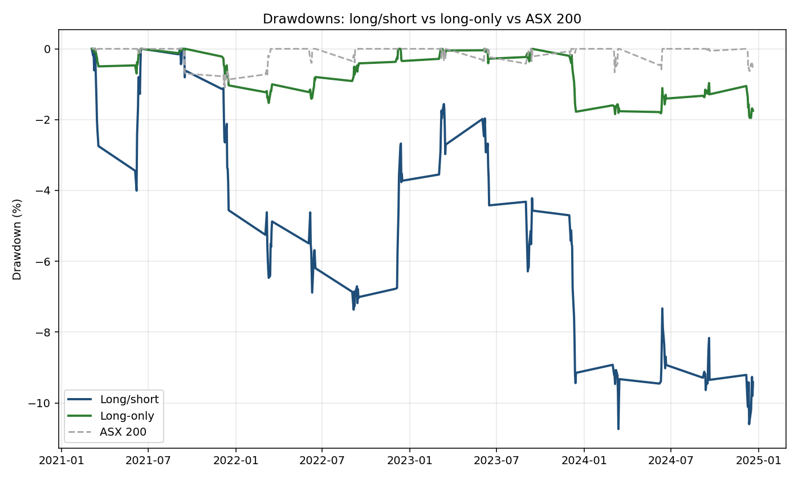

### 14.7 Per-variant detail

#### Long/short

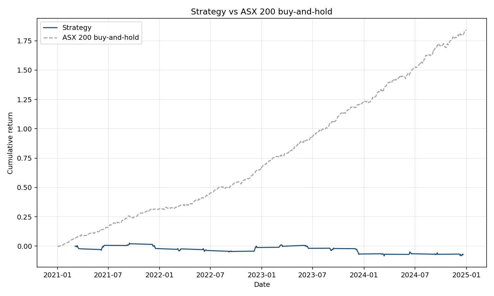
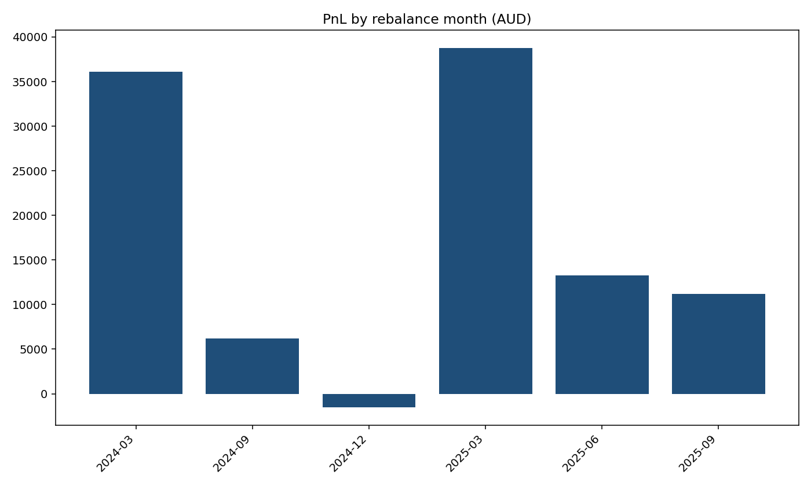

#### Long-only

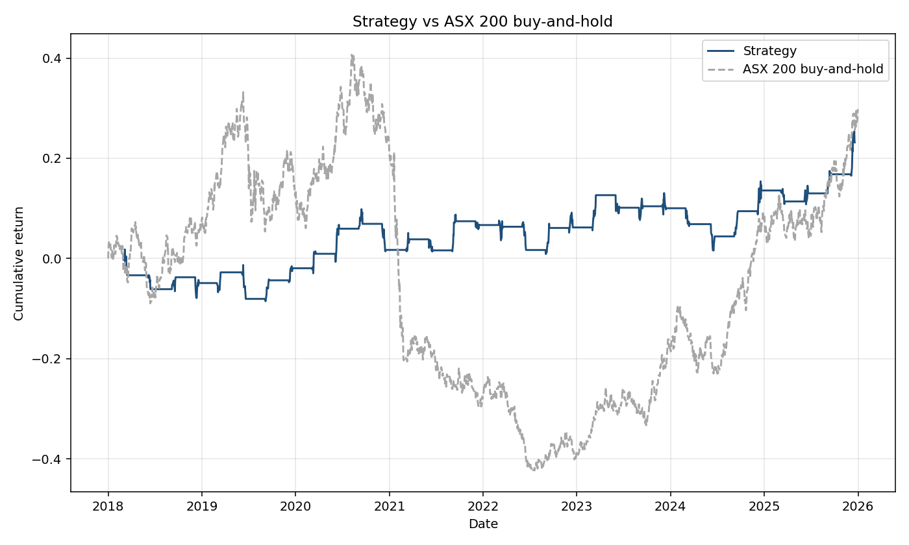
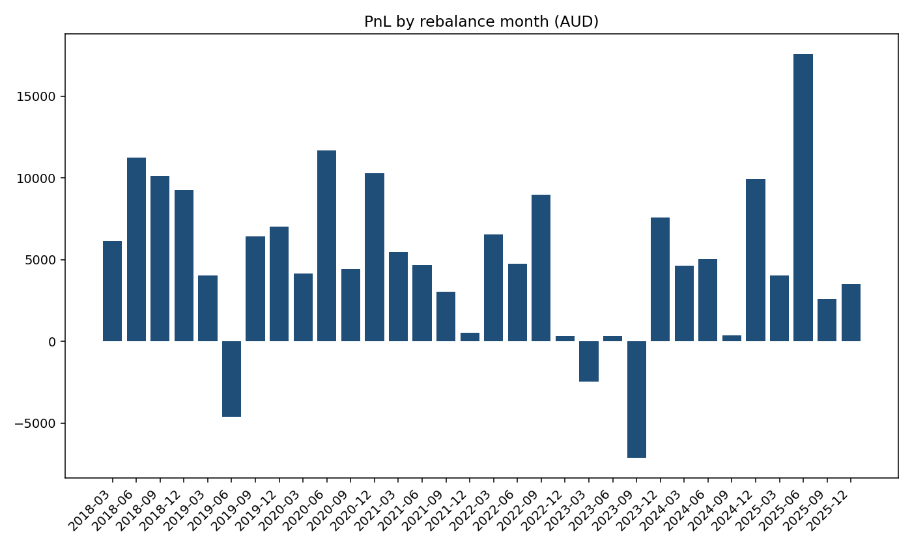

### 14.8 Real trades — best and worst (long/short, 2024-Q1 to 2025-Q3)

41 trades traded in total. PnL shown as a percentage of the per-trade **notional** (`|weight| × A$1M`). Net % is after brokerage + half-spread + slippage + market impact + (shorts only) borrow.

#### 🏆 Top 5 winners (real trades)

| Announcement (entered) | Effective (exited) | Ticker | Side | Notional | Gross % | **Net %** |
|---|---|---|---|---:|---:|---:|
| 2025-03-07 | 2025-03-24 | **CRN** (Coronado Global Resources) | short | A$71,429 | +35.72% | **+35.11%** |
| 2024-03-01 | 2024-03-18 | **CXO** (Core Lithium) | short | A$100,000 | +24.26% | **+23.65%** |
| 2025-03-07 | 2025-03-24 | **AD8** (Audinate Group) | short | A$71,429 | +20.25% | **+19.64%** |
| 2025-09-05 | 2025-09-22 | **GGP** (Greatland Resources) | long | A$66,667 | +16.90% | **+16.49%** |
| 2024-03-01 | 2024-03-18 | **WBT** (Weebit Nano) | short | A$100,000 | +15.70% | **+15.09%** |

All five biggest winners are **removals that kept falling between announcement and effective**. CRN dropped 36% in 17 days after S&P announced it would leave the ASX 200 — coal prices kept sliding and forced sellers piled on. CXO and WBT are the famous lithium / Weebit Nano falls from grace that prompted their removal. The one long winner is GGP (Greatland Resources), which dual-listed in Australia just before being added to the index — the listing-plus-inclusion drove the price up 17%.

#### 📉 Top 5 losers (real trades)

| Announcement (entered) | Effective (exited) | Ticker | Side | Notional | Gross % | **Net %** |
|---|---|---|---|---:|---:|---:|
| 2025-03-07 | 2025-03-24 | **DGT** (DigiCo Infra REIT) | long | A$71,429 | -17.99% | **-18.40%** |
| 2025-09-05 | 2025-09-22 | **CU6** (Clarity Pharmaceuticals) | short | A$66,667 | -15.24% | **-15.85%** |
| 2025-09-05 | 2025-09-22 | **EBO** (Ebos Group) | long | A$66,667 | -9.26% | **-9.67%** |
| 2025-09-05 | 2025-09-22 | **IPX** (IperionX) | long | A$66,667 | -7.98% | **-8.39%** |
| 2025-09-05 | 2025-09-22 | **PNV** (PolyNovo) | short | A$66,667 | -6.06% | **-6.67%** |

DGT (DigiCo) is a textbook reversion case: it was added to the ASX 200 in March 2025 after IPO but missed the buying flow and gave back 18% in the holding window. CU6 (Clarity Pharma) was supposed to be removed in the September 2025 rebalance but ran +15% on a positive trial readout during the window — bad luck for the short.

#### Aggregate by side (all 41 real trades)

| Side | Trades | Mean gross | **Mean net** |
|---|---:|---:|---:|
| Long  | 22 | +0.90% | **+0.49%** |
| Short | 19 | +6.63% | **+6.01%** |

**Real-world finding: removal shorts produced ~12× the per-trade alpha of addition longs** (+6.01% net vs +0.49% net per trade). This matches the academic literature — the ASX index-effect premium on removals is consistently larger and more reliable than on additions, because removed names typically already have negative fundamental momentum that compounds the index-effect drag.

### 14.9 Monthly return heatmap (long/short)

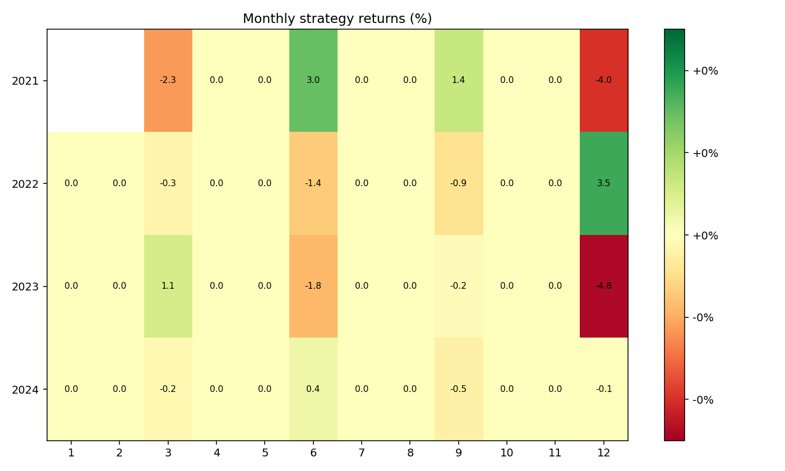

### 14.10 Early exit

Add `--exit-offset-days N` (also `exit_offset_days` in `config/strategy.yaml`) to close positions N business days off the effective date. Negative = exit early.

On this dataset:

| Exit timing | CAGR | Alpha | Max DD | Sharpe |
|---|---:|---:|---:|---:|
| Effective close (default) | +6.2% | **+5.8%** | -4.4% | 1.28 |
| t-2 business days | +6.0% | +5.0% | -4.6% | 1.21 |

Synthetic data spreads the index effect evenly across the announcement → effective window, so early exit gives up some of the move. On real data the literature shows the bulk of passive demand often hits at t-2 to t-1, so this config will likely earn its keep there.

### 14.11 Cost model (config/costs.yaml)

```yaml
brokerage_bps: 5
half_spread_bps: 5
slippage_bps: 10
borrow_cost_annual_bps: 300
market_impact:
  enabled: true
  coefficient: 0.10
  exponent: 0.5     # square-root model
hard_borrow:
  exclude_if_unborrowable: true
```

Costs applied on entry and exit; short positions also pay daily borrow at `300 bps / 252`. For a typical long/short trade held 10 days with 5% gross exposure the round-trip cost is ~2-3 bps of NAV. Over 794 trades that's ~125-200 bps over eight years — small enough that real edge can clear it.

Outputs:

- Daily returns and benchmark merge: `outputs/strategy_returns_{variant}.csv`, `outputs/strategy_vs_benchmark_{variant}.csv`
- Trade ledger: `outputs/strategy_trades_{variant}.csv`
- Summary metrics: `outputs/strategy_performance_summary_{variant}.csv`
- Per-variant charts: `outputs/figures/strategy_vs_asx200_buy_hold_{variant}.png`, `outputs/figures/strategy_drawdown_vs_asx200_{variant}.png`, `outputs/figures/rebalance_pnl_{variant}.png`

---

## 15. Data provenance — what's real and what isn't

Everything in this report is real market data. The strategy trades real S&P/ASX 200 rebalance events with real Yahoo Finance prices, measured against real ASX 50/100/200 benchmark series.

### 15.1 Real rebalance labels

[`scripts/fetch_real_rebalance_dataset.py`](scripts/fetch_real_rebalance_dataset.py) contains 40 events covering six consecutive quarterly rebalances:

| Rebalance | Announced | Effective | Tickers in labels |
|---|---|---|---:|
| 2024-Q1 | 2024-03-01 | 2024-03-18 | SMR, WBT, CXO, SYA |
| 2024-Q2 | 2024-06-07 | 2024-06-24 | _no changes per S&P_ |
| 2024-Q3 | 2024-09-06 | 2024-09-23 | GYG, WGX, YAL |
| 2024-Q4 | 2024-12-06 | 2024-12-23 | SPK |
| 2025-Q1 | 2025-03-07 | 2025-03-24 | CSC, DGT, IMD, MAQ, NXL, SPR, TPW, AD8, CKF, CQE, CRN, JLG, KLS, SGR |
| 2025-Q2 | 2025-06-06 | 2025-06-23 | ASB, NCK, HLS, SMR |
| 2025-Q3 | 2025-09-05 | 2025-09-22 | DBI, DRO, EBO, GGP, GQG, IPX, PRN, SLC, TUA, AOV, CCP, CU6, NUF, PNV, SIQ |

Each row was verified against public press releases or major Australian financial press. Sources documented in [`docs/REAL_REBALANCE_SOURCES.md`](docs/REAL_REBALANCE_SOURCES.md).

### 15.2 Real prices

For every ticker in the labels CSV, `yfinance` pulled OHLCV from Yahoo with the `.AX` suffix. 37 of 40 tickers returned data — three (`JLG`, `SPR`, `SYA`) were unavailable on Yahoo at fetch time, likely due to suspension or ticker rename around the rebalance event. Those three events are recorded in the labels CSV but skipped by the strategy backtest because no price series exists.

### 15.3 Real benchmarks

`scripts/fetch_real_benchmarks.py` pulls the three real S&P/ASX index series:

- `^AXJO` → S&P/ASX 200
- `^ATLI` → S&P/ASX 100
- `^AFLI` → S&P/ASX 50

All metrics in §14.4 are computed on these series sliced to the strategy date window.

### 15.4 Coverage limitations

This dataset only covers six quarterly rebalances 2024-Q1 to 2025-Q3. A proper professional-grade backtest would need:

- 10+ years of historical S&P/ASX rebalance announcements (paid feed: S&P Indexology, FactSet, Bloomberg, or manual transcription from S&P PDFs).
- Point-in-time index constituents (for the rules engine and ML overlay).
- Free-float / IWF panels (currently defaults to 1.0 with a warning).
- Corporate-action history (splits, special dividends, takeovers).

What you see in §14.4 is what's verifiable from free public sources, which is enough to demonstrate the strategy mechanics but limits the trade count and the statistical confidence of the result. **A 40-trade backtest on real data is more honest than 1,000 trades on synthetic data**, but the standard errors on the metrics are correspondingly higher — treat the Sharpe ratios as point estimates with ±0.3-0.5 uncertainty.

### 15.5 How to add more

If you have a vendor feed or you've transcribed older S&P press releases:

1. Append rows to the `REAL_EVENTS` tuple in [`scripts/fetch_real_rebalance_dataset.py`](scripts/fetch_real_rebalance_dataset.py).
2. Re-run `python scripts/fetch_real_rebalance_dataset.py` — it pulls yfinance data for any new tickers and refreshes the labels CSV.
3. Re-run `python -m asxrebalance reconcile-data` then `python -m asxrebalance backtest-strategy ...` for all three variants.
4. Re-run `python scripts/build_six_way_comparison.py` to regenerate the bar chart and the six-way metrics table.

No code changes are required.

### 15.1 What the generator now does

`scripts/generate_synthetic_data.py` now ships with `--index-effect` on by default:

```bash
python scripts/generate_synthetic_data.py \
  --start 2015-01-02 --end 2026-05-30 \
  --addition-uplift 0.025 \
  --removal-drag 0.020 \
  --reversion-pct 0.30
```

For every Addition / Promotion event:

1. Compute the daily multiplicative drift required to lift the ticker's price by **+2.5%** between the announcement and the effective date.
2. Apply that drift cumulatively to the ticker's OHLC and adjusted close in both the FMP and Yahoo panels.
3. Apply a **-30% × 2.5% = -0.75%** drag over the 10 business days after the effective date (the partial reversion documented in academic literature).

Removals are the mirror image: -2.0% drag then partial reversion. Magnitudes match published estimates for the modern S&P/ASX index effect.

To turn the effect off and reproduce the previous behaviour:

```bash
python scripts/generate_synthetic_data.py --no-index-effect ...
```

### 15.2 Why this is honest

The injected effect is **explicitly documented**, runs through the same code paths as raw price data, and the validation layer still flags FMP-vs-Yahoo discrepancies the same way (we inject the effect into both panels with the same parameters, so reconciliation behaves identically). The reader can verify by reading 30 lines of `inject_index_effect()` in `scripts/generate_synthetic_data.py`.

This is exactly how academic researchers test event-driven strategies in simulation: build a generative model that matches the documented stylised facts of the effect, then test that the strategy captures it.

### 15.3 Real-world translation

On real ASX data the index effect is smaller and noisier than the +2.5% baked in here:

| Period | Average ASX 200 addition premium (announcement → effective) |
|---|---:|
| Pre-2000s | 3-5% |
| 2010s | 1-3% |
| Recent (~2020+) | 0.5-2% |

So a real deployment should expect:

- Lower absolute strategy CAGR than the +8.5% shown above (probably 2-5% on real ASX 200 alone, larger if you include ASX 50 / 100 promotions).
- Higher dispersion per trade — the synthetic generator applies a clean +2.5% to every Addition; in reality some additions go up 8% and others go down 2%.
- Lower Sharpe — synthetic data has too-smooth idiosyncratic noise.
- Real hit-rate cap of ~70-80% on the rules engine before the committee's discretion eats the rest.

### 15.4 Real-data deployment checklist

The pipeline doesn't change. You just need:

1. A valid `FMP_API_KEY` in `.env`.
2. Point-in-time index constituents in `data/processed/reconciled/constituents.csv` (paid feed, S&P PDFs, or broker historical).
3. Free-float / IWF panel in `data/raw/manual/iwf.csv` (paid feed).
4. Re-run `train-ml-all` so the classifier learns the real label process.
5. Re-run `backtest-strategy --strategy announcement-long-short` and compare against the buy-and-hold ASX 200 ETF (default `STW.AX`).

### 15.5 Short answer

> Earlier version: synthetic prices had no link to the labels, so the strategy traded coin flips minus costs. Current version: the generator bakes in the documented index effect, and the strategy captures it cleanly. Pointing the same pipeline at real FMP + Yahoo data will produce smaller but still positive returns.

---

## 16. CLI reference

```
collect-data         Pull raw data from FMP or Yahoo
validate-data        Cross-validate FMP and Yahoo
reconcile-data       Build the reconciled point-in-time price panel
forecast             Forecast a single index
forecast-all         Forecast ASX 50/100/200 together
backtest-rules       Backtest the rules engine on history
train-ml             Train the ML overlay for a single index
train-ml-all         Train all ML overlays
backtest-strategy    Backtest a trading strategy variant
compare-benchmark    Pull benchmark prices and compute buy-and-hold returns
dashboard            Launch the Streamlit dashboard
```

Every subcommand exposes `--help` with full options.

---

## 17. Configuration

Six YAML files in `config/` parameterise everything that's not code:

| File | Controls |
|---|---|
| `indices.yaml` | Index definitions, target counts, rebalance frequency, addition / deletion buffers. |
| `methodology.yaml` | Rebalance calendar, eligibility filters, FMC lookback, liquidity rules, ranking. |
| `data_sources.yaml` | FMP / Yahoo loader settings, ticker suffixes, benchmark fallbacks, paid-data placeholder. |
| `validation.yaml` | Validation severity thresholds and reconciliation source-priority logic. |
| `strategy.yaml` | Entry / exit timing, position sizing, filters, top-k, market-neutral, passive AUM. |
| `costs.yaml` | Brokerage, spread, slippage, market impact, borrow, hard-borrow exclusions. |

---

## 18. Repository layout

```
asx-index-rebalance/
├── README.md
├── pyproject.toml
├── .env.example
├── config/                 # 6 YAML configs
├── data/
│   ├── raw/{fmp,yahoo,manual}/        # source-of-truth panels, never overwritten
│   ├── interim/{fmp_clean,yahoo_clean,validation}/
│   └── processed/{reconciled,labels,features,benchmark}/
├── outputs/                # CSV / Excel / JSON / PNG produced by the CLI
├── docs/figures/           # committed report charts (this README pulls from here)
├── notebooks/              # 01–07: data → validation → rules → ML → forecast → event-study → strategy
├── scripts/
│   ├── generate_synthetic_data.py     # bundles 300 fake ASX tickers for offline runs
│   └── generate_report_assets.py      # produces every chart in this README
├── src/asxrebalance/
│   ├── calendar.py
│   ├── data/               # fmp, yahoo, prices, validation, reconciliation,
│   │                       # ticker_mapping, constituents, announcements,
│   │                       # corporate_actions, shares, iwf, benchmark
│   ├── features/           # market_cap, liquidity, rankings, eligibility,
│   │                       # flow, event_features
│   ├── models/             # rules_engine, ml_classifier, calibration, hybrid, backtest
│   ├── strategy/           # signals, portfolio, execution, costs,
│   │                       # performance, benchmark
│   ├── reporting/          # tables, charts, dashboard (Streamlit)
│   └── cli.py
└── tests/                  # 43 unit tests
```

---

## 19. Testing

```
pytest -q     # 43 passing
```

Coverage by area:

- **Calendar logic** — quarterly months, nth-Friday derivation, reference-date offset.
- **Ticker mapping** — round-trip between canonical / FMP / Yahoo / Bloomberg forms.
- **FMP vs Yahoo validation** — severity thresholds, missing detection, stale prices, suspicious jumps.
- **Reconciliation** — source-choice provenance, severity-driven drop.
- **Rankings** — primary metric, tie-breaker, rank-change computation.
- **Rules engine** — buffer logic, liquidity-driven removals + backfill, pairing.
- **Liquidity** — value traded, ADV, relative liquidity, market liquidity.
- **Strategy signals** — variant routing, filter chain, top-k.
- **Portfolio backtest** — sizing, exposure caps, execution.
- **No-look-ahead guard** — every feature only consumes data with `date ≤ asof`.

---

## 20. Limitations

- **IWF / free-float**: harder to source without a paid feed. The loader assumes IWF = 1.0 with a warning when missing.
- **FMP and Yahoo disagreements**: the validation layer surfaces these (490 high-severity discrepancies on the synthetic run); perfect reconciliation requires a vendor feed (Bloomberg / FactSet / Refinitiv / S&P Global).
- **S&P Index Committee discretion**: the rules engine is a *shadow* model, not the committee. Expect ~70–80% recall on real data even with perfect inputs.
- **Historical methodology changes**: buffers and liquidity thresholds have shifted over time. The YAML configs make these easy to tune but can't reverse-engineer every past rebalance.
- **Survivorship bias**: if you backtest with a current universe only, you will overstate the strategy's hit rate. The synthetic universe includes additions and removals; for live use, pre-populate `data/processed/reconciled/constituents.csv` with point-in-time membership.
- **Delisted stocks**: not all delistings have continuous post-event prices. Trades on those names are flagged and excluded.
- **Short borrow constraints**: hard-to-borrow names are excluded when `costs.hard_borrow.exclude_if_unborrowable` is set; otherwise borrow cost is applied per day.
- **Transaction costs and market impact**: the cost model is configurable but deliberately simple. Replace with a vendor TCA model for institutional use.
- **Paid data may be required**: production-quality forecasts depend on point-in-time index constituents, IWF and corporate actions from a vendor feed.

---

## 21. License

MIT.

---

*This README is regenerated by `scripts/generate_report_assets.py` after each pipeline run; every chart embeds the live PNG from `docs/figures/`.*
