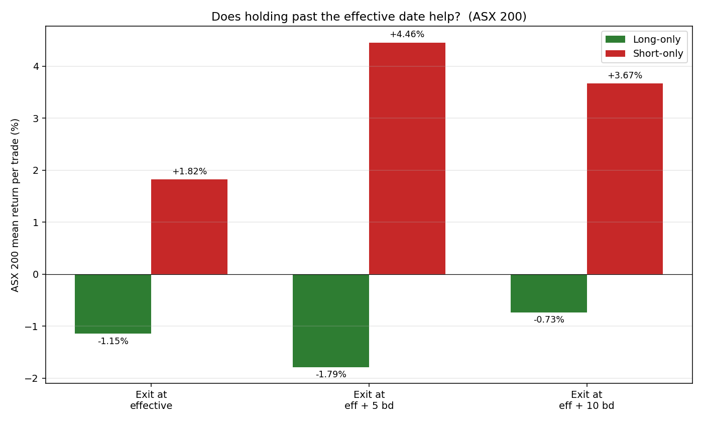
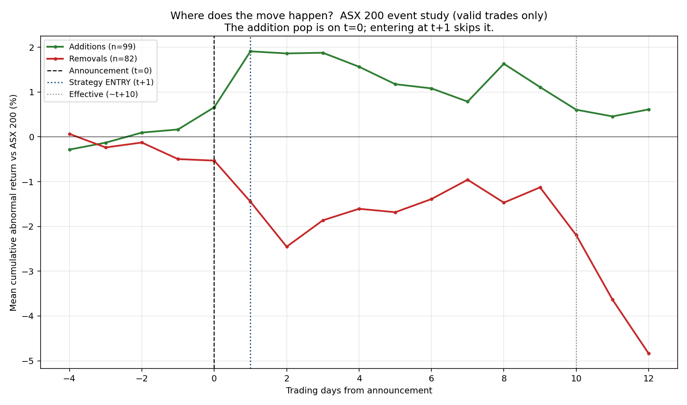

# ASX Index-Rebalance Effect — Real-Data Study

A clean, fully real-data study of the S&P/ASX index-rebalance effect: when a
stock is **added to** or **removed from** the ASX 20 / 50 / 100 / 200, does
trading around the change make money?

**Everything here is real.** Rebalance events come from the official S&P Dow
Jones Indices announcement PDFs. Prices come from Yahoo Finance. Benchmarks are
the real S&P/ASX 50, 100 and 200 index series. Nothing is simulated. Every
return is shown as a percentage.

> **Why the repo was rebuilt:** an earlier version of this study reported large
> positive returns that turned out to be **data artifacts**. An adversarial
> verification pass (4 independent agents, each double-checked) found three
> classes of corruption — a price-lookup bug that fabricated 33 fake 0% trades,
> Yahoo ticker-reuse serving the wrong company's history, and frozen
> zero-volume windows — plus a PDF-parser mis-attribution. All are now fixed
> and documented in [§5](#5-data-quality--what-was-thrown-out). The honest
> result is smaller and more nuanced than the buggy version implied.

---

## 1. TL;DR — what the real data says

Trading rule: **buy additions / short removals at the close of the trading day
*after* the announcement; exit at the effective-date close** (and we also test
holding 5 and 10 days longer). 314 valid trades, 43 quarterly rebalances,
Sep-2012 → Dec-2025.


- **The edge is on the short side — shorting removals.** ASX 200 removals fall
  on average **−1.8% per trade** by the effective date and keep falling after,
  so shorting them returns **+1.8% per trade** (54% win rate). Hold the short
  5 days past effective and it's **+4.5% per trade, 70% win rate** (see §4).
- **The long side (buying additions) does *not* work on ASX 200** — it loses
  **−1.1% per trade.** Not a bug: the addition price pop happens *on
  announcement day*, and entering the next day buys the peak and rides the
  decay (see §6, the event study).
- **Smaller indices behave better on the long side.** ASX 20 additions return
  +1.3%/trade and ASX 100 additions +0.5%/trade — the index effect is stronger
  where the passive flow is large relative to the stock's float.
- **No strategy variant beats simply holding the index** in absolute terms,
  because the strategy is **in cash ~89% of the time** (it only holds positions
  for ~10 trading days a quarter). See §7 for the honest benchmark discussion.

There is a **real, statistically sensible removal-side effect**; there is **no
usable addition-side effect on ASX 200** on modern data. This matches the
academic "disappearing index effect" literature.

---

## 2. The data source — official S&P PDFs

Every rebalance event is parsed directly from the S&P Dow Jones Indices
quarterly announcement PDFs (the same documents Bloomberg/Reuters quote),
archived at marketindex.com.au. 53 PDFs covering 2011-Q3 → 2025-Q4 are stored
in [`data/raw/marketindex/multi/`](data/raw/marketindex/multi/).

Each PDF has a separate table per index tier. [`scripts/parse_sp_pdfs_all_indices.py`](scripts/parse_sp_pdfs_all_indices.py)
extracts every Addition / Removal with its index, ticker and effective date:

| Tier | Events parsed |
|---|---:|
| ASX 20 | 29 |
| ASX 50 | 41 |
| ASX 100 | 111 |
| ASX 200 | 326 |
| ASX 300 | 2,026 |

The labels are in [`data/processed/labels/rebalance_labels.csv`](data/processed/labels/rebalance_labels.csv).
This study trades the ASX 20/50/100/200 tiers.

> **On "cross-referencing marketindex":** marketindex.com.au's announcement page
> simply links to these same S&P PDFs, so it is not an independent source — it
> *is* the source. The genuinely independent check is OpenASX (ETF-holdings
> snapshots); see §5.

---

## 3. The trade

| Step | Rule |
|---|---|
| **Signal** | An ASX 20/50/100/200 Addition or Removal in an S&P PDF. |
| **Entry** | Close of the **next trading day after** the announcement date. |
| **Exit** | Close of the **effective date** (tested: also +5 and +10 trading days). |
| **Long** | Buy the **Additions**. |
| **Short** | Short the **Removals** (short return = −1 × price move). |
| **Sizing** | One unit per trade; returns are per-trade %. Quarterly equal-weight then compounded for the "total" figures. |

The announcement → effective gap is ~10 trading days (announcement is the first
Friday of Mar/Jun/Sep/Dec; effective is after the third Friday).

---

## 4. Results

### 4.1 Per-trade return and win rate (exit = effective close)

| Tier | Side | n | Mean/trade | Median/trade | Win rate |
|---|---|---:|---:|---:|---:|
| ASX 20 | Long | 12 | **+1.27%** | +2.40% | 67% |
| ASX 20 | Short | 14 | **+2.22%** | +1.65% | 64% |
| ASX 50 | Long | 20 | −3.51% | −2.78% | 25% |
| ASX 50 | Short | 15 | +0.70% | +0.29% | 67% |
| ASX 100 | Long | 37 | +0.50% | −0.29% | 49% |
| ASX 100 | Short | 35 | −0.78% | −0.45% | 43% |
| ASX 200 | Long | 99 | **−1.15%** | −0.71% | 42% |
| ASX 200 | Short | 82 | **+1.83%** | +1.69% | 54% |


### 4.2 Does holding past the effective date help? (ASX 200)

The removal-side effect keeps compounding *after* the effective date — forced
index sellers overshoot. Holding the short 5 days longer is the single biggest
improvement in the study:



| ASX 200 Short-only | Mean/trade | Median | Win rate | n |
|---|---:|---:|---:|---:|
| Exit at effective | +1.83% | +1.69% | 54% | 82 |
| **Exit at effective + 5 bd** | **+4.46%** | **+3.76%** | **70%** | 81 |
| Exit at effective + 10 bd | +3.67% | +3.92% | 62% | 82 |

**ASX 200 short, exit at +5 business days: +4.46% per trade at a 70% win
rate** — the strongest, most robust result in the study.

### 4.3 Compounded total return (with the honest caveat)

Compounding an equal-weight basket each quarter (this is outlier-sensitive — a
single bad quarter swings it, so the trimmed column drops the best & worst
quarter):

| Tier · Side (exit = effective) | Compound | Compound (trimmed) |
|---|---:|---:|
| ASX 20 · Long & short | +44.4% | +33.7% |
| ASX 200 · Short-only | +6.2% | +19.6% |
| **ASX 200 · Short-only, exit +5 bd** | **+66.2%** | **+98.0%** |
| ASX 200 · Long-only | −21.4% | −6.5% |

The compound numbers are reported for completeness but the **per-trade mean and
median in §4.1/§4.2 are the honest primary metrics** — see §7.

---

## 5. Data quality — what was thrown out

Of 507 ASX 20/50/100/200 events, **314 became valid trades** and **193 were
rejected** with a recorded reason ([`outputs/v2_rejected.csv`](outputs/v2_rejected.csv)):

| Reason | Count | What it means |
|---|---:|---|
| `no_price_file` | 139 | Ticker delisted long ago; Yahoo has no series at all. |
| `no_history_at_event` | 33 | **The fixed bug.** Yahoo's history for the (delisted) name starts *years after* the rebalance. The old code silently used the first available bar → fake 0.00% trade on wrong-year prices. Now rejected. |
| `illiquid_or_stale` | 8 | Median daily turnover < A$250k in the window — not a real index-level constituent series. |
| `zero_volume_endpoint` | 6 | Entry or exit bar had zero volume (frozen/suspended). |
| `entry_gap` | 4 | No real bar within 5 trading days of the entry target. |
| `known_ticker_reuse` | 3 | **AHE, VRL** — Yahoo reassigned the delisted ticker to a different micro-cap and serves *that* company's history (e.g. "AHE" showed 24¢ when Automotive Holdings really traded ~A$3.50). Hard-excluded. |

The validation gate lives in [`scripts/run_strategy_v2.py`](scripts/run_strategy_v2.py)
(`build_trade()`): a trade is valid only if the price file covers the
announcement, a real bar exists within 5 trading days of each target, the hold
is positive, and median turnover clears an index-level floor.

**Independent check (OpenASX):** our labels were also cross-checked against
[OpenASX](https://openasx.tangerineslab.com) ETF-holdings snapshots. 2012–2017
membership flips confirm at 75–100%; later years are only spot-checkable where
the (sparse) snapshots bracket a rebalance. One genuine parser error was caught
and fixed this way: a December-2018 "All Australian 50" removal of **ORI**
(Orica) had been mis-attributed to the ASX 200 (which was "No change" that
quarter).

---

## 6. Why the long (additions) leg loses

This is the question that kept coming up. The answer is in the event study —
the average price path of ASX 200 additions and removals in **event time**
(day 0 = announcement), using only validated trades:



- **Additions (green) pop +1.9% from t=0 to t+1** — the market prices in the
  inclusion *on announcement day*. Our entry is t+1 (the next close), so we
  **buy at the top of the pop** and then ride a slow **decay back down** to the
  effective date. That's the −1.1%/trade long result. It is a real timing
  effect, not a calculation error.
- **Removals (red) slide steadily and then drop hard after the effective date**
  (−2.2% at t+10 → −4.8% by t+12) as passive funds finish dumping. Shorting and
  holding a few days past effective captures that — hence the +4.5% short result
  at exit+5.

To actually profit from the long side you'd need to enter on the announcement
day itself (or before), not the day after — a much harder, more
information-sensitive trade.

---

## 7. Honest comparison to buy-and-hold, and the "flat chart" question

Real S&P/ASX index total return over the study window (price indices, so they
exclude dividends):

| Benchmark | Total return | Window |
|---|---:|---|
| ASX 50 (`^AFLI`) | +59% | 2013-03 → 2026-01 |
| ASX 100 (`^ATLI`) | +51% | 2013-03 → 2026-01 |
| ASX 200 (`^AXJO`) | +101% | 2012-09 → 2026-01 |

**No strategy variant beats buy-and-hold in absolute terms, and that comparison
is not even fair**, because:

- The strategy is **in the market only ~11% of trading days** (≈3 trades per
  quarter, held ~10 days each). The other ~89% it is in cash.
- That is exactly why a **cumulative-return-over-calendar-time line chart is the
  wrong visualization** — it shows a flat staircase (flat whenever the strategy
  is in cash, with a step at each rebalance), which tells you nothing about
  whether the *trades* are good. This study therefore reports **per-trade
  return, win rate and distribution** instead of a cumulative line. The
  flatness was never a bug; it is the nature of an event-driven strategy.

The right way to read this study: the **per-trade edge** (does shorting a
removal make money on average?) is the question, and the answer is **yes for
removals (+1.8% to +4.5%/trade), no for ASX 200 additions.** Whether that edge
is large enough to deploy real capital — after borrow costs, market impact and
the cash drag of being 89% idle — is a separate question this study does not
claim to answer in the affirmative.

---

## 8. Reproduce it

```bash
pip install -e ".[all]"

# 1. Download the official S&P PDFs (via marketindex CDN)
python scripts/fetch_sp_pdfs.py

# 2. Parse every tier's add/remove events from the PDFs
python scripts/parse_sp_pdfs_all_indices.py

# 3. Fetch real Yahoo prices for every ticker in the labels
python scripts/fetch_prices_for_labels.py

# 4. Run the validated strategy (entry = ann+1, exits = eff / +5 / +10)
python scripts/run_strategy_v2.py

# 5. Build the charts (no cumulative line; per-trade bars + event study)
python scripts/build_v2_charts.py
```

Outputs:

- [`outputs/v2_trades.csv`](outputs/) — every valid trade with entry/exit dates **and prices** (cross-check any row on Yahoo Finance).
- [`outputs/v2_rejected.csv`](outputs/) — every dropped event with its reason.
- [`outputs/v2_summary.csv`](outputs/) — per tier × side × exit: mean, median, win rate, compound.
- [`outputs/v2_benchmarks.csv`](outputs/) — real ASX 50/100/200 total returns.

---

## 9. Key files

```
scripts/
  fetch_sp_pdfs.py               download S&P announcement PDFs
  parse_sp_pdfs_all_indices.py   extract per-tier add/remove events (+ "No change" guard)
  fetch_prices_for_labels.py     pull real Yahoo prices for every ticker
  run_strategy_v2.py             validated backtest (the trade-validation gate lives here)
  build_v2_charts.py             per-trade bars, win rate, exit window, event study
data/
  raw/marketindex/multi/*.pdf    53 official S&P PDFs
  processed/labels/rebalance_labels.csv   parsed events
  processed/benchmark/*.csv      real ASX 50/100/200 index series
outputs/                         trades, rejects, summary, benchmarks
docs/figures/                    the charts embedded above
```

---

## 10. Limitations

- **Survivorship in delisted names.** 139 events are on tickers Yahoo no longer
  carries; those trades can't be evaluated. Many are removals (often the
  most-distressed names), so the *true* short-side edge may be **understated**.
- **Price indices, not accumulation.** Benchmarks exclude dividends (~4%/yr),
  so absolute benchmark returns are conservative; relative comparison still holds.
- **No transaction costs in the headline per-trade numbers.** Short borrow,
  half-spread, slippage and market impact would each reduce the edge; a 70%
  win-rate +4.5% gross short trade survives realistic costs, a +0.5% long trade
  likely does not.
- **Sample size.** ASX 20 (26 trades) and ASX 50 (35) are small; treat those
  tiers as indicative. ASX 200 (181 trades) is the robust sample.
- **Adjusted-close basis.** Returns use Yahoo adjusted close (handles splits and
  dividends within the holding window).

## License

MIT.
