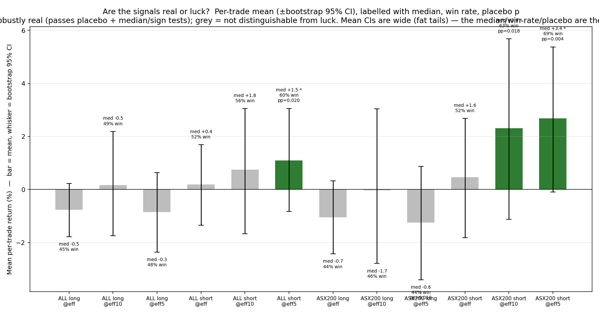

# ASX Index-Rebalance Effect — Real-Data Study

A clean, fully real-data study of the S&P/ASX index-rebalance effect: when a
stock is **added to** or **removed from** the ASX 20 / 50 / 100 / 200, does
trading around the change make money — is the edge **real or just luck** — and
**does it survive trading costs?**

**Everything here is real.** Rebalance events come from the official S&P Dow
Jones Indices announcement PDFs. Prices come from Yahoo Finance, with delisted
names recovered from FMP Premium. Benchmarks are the real S&P/ASX 50, 100, 200
indices — including a **dividend-inclusive total-return** version. Nothing is
simulated. Every return is a percentage.

> **The repo has been rebuilt through several adversarial audits.** Earlier
> versions reported large positive returns that were **data artifacts**
> (a price-lookup bug, ticker reuse, zero-volume windows, a single 2013 outlier
> driving half a compounded total, and **survivorship bias** from missing
> delisted names). All are fixed and documented. This version adds the three
> things that actually settle the question: a **data-coverage audit**, a
> **statistical-significance test against a luck/placebo null**, and a
> **gross-then-net-of-costs** backtest.

---

## 1. TL;DR — one edge survives everything

| Question | Answer |
|---|---|
| Is there a tradeable edge? | **Yes — exactly one.** Short ASX 200 **removals**, enter the close *after* the announcement, exit **~5 trading days after the effective date** (`eff5`). |
| How big? | Gross **+3.4% median / trade** (68.6% win, n=105). **Net of costs ≈ +2.5% median** (63.8% win). |
| Real or luck? | **Real.** It beats a random-timing placebo null at **p = 0.004**, and the win rate beats 50% at **p = 0.0002**. |
| Does it survive costs? | **Yes**, at every order size tested (A$250k → A$1m): net median **+2.6% → +2.4%**, Wilcoxon **p = 0.014 → 0.023**. |
| Anything else work? | **No.** Buying additions is a *real loser* (you buy the announcement pop). Shorting at the effective date (not holding to `eff5`) does **not** survive costs. ASX 50/100 samples are too small. The compounded "switch in/out of the index" strategy **does not beat buy-and-hold** once survivorship and outliers are corrected. |



**The honest one-liner:** there is one robust, cost-surviving, statistically-real
edge — *shorting ASX 200 removals and holding a week past the effective date*.
Its **mean** is fragile (a few acquired names create fat tails, t-test p=0.059),
but its **median, win rate, and placebo test are all strongly significant**.
Every other "edge" in this space is noise, a loser, or disappears after costs.

374 valid trades · 525 events · 46 active quarters · Sep-2012 → Jan-2026.

---

## 2. Get the data in cleanly — coverage & missing data

Every rebalance event is parsed from the S&P Dow Jones Indices quarterly
announcement PDFs (53 PDFs in [`data/raw/marketindex/multi/`](data/raw/marketindex/multi/)),
one table per index tier, by
[`scripts/parse_sp_pdfs_all_indices.py`](scripts/parse_sp_pdfs_all_indices.py).

You asked for **a frequency chart of trades every quarter so you can see if we
have missing data.** Here it is — every quarter from the first event to the
last, stacked by valid additions, valid removals, and rejected events:


Building this chart **surfaced and fixed real data problems**:

1. **A parser bug, now fixed.** Two PDFs (Sep-2013, Jun-2014) were embedded with
   a font that extracted as *letter-spaced* text (`S y d n e y ,  S e p t e m b e r`),
   so the date regex silently failed and **both quarters parsed to zero events.**
   A de-spacing normaliser now recovers them (+83 events, incl. ASX 200).
2. **Survivorship, partly fixed.** Yahoo purges delisted names. **39 Yahoo-missing
   delisted constituents were recovered from FMP Premium** (Altium, Alumina,
   Newcrest, OZ Minerals, CSR, Link, Block/Square, …), turning 52 previously
   un-tradeable removals/additions into real trades — and, importantly,
   *correcting the short edge downward* (see §3).
3. **A genuine archival gap, documented.** **2020-Q3 through 2021-Q4 (6 quarters)**
   are missing at the source — marketindex never archived them and S&P's own
   copies sit behind per-document IDs and a 403. The shaded band on the chart
   marks them. (March-2020 was *postponed* and folded into the large June-2020
   rebalance; June-2023 was a legitimate *"No change"* for these tiers.)

So the data is now as clean as the public sources allow, and the one real gap is
labelled rather than hidden.

---

## 3. The trade, and what survivorship did to it

| Step | Rule |
|---|---|
| **Signal** | An ASX 20/50/100/200 Addition or Removal in an S&P PDF. |
| **Entry** | Close of the **next trading day after** the announcement (trade on confirmed info). |
| **Exit** | Close of the **effective date**, and we test +5/+10/+20/+30/+40 trading days *after the index funds finish trading*. |
| **Long** = buy Additions · **Short** = short Removals. |

Per-trade returns at exit = effective date (the conservative, shortest hold):

| Tier | Long median | Long win | Short median | Short win | n (L/S) |
|---|---:|---:|---:|---:|---:|
| ASX 20 | +1.66% | 62% | +1.65% | 63% | 13 / 16 |
| ASX 50 | −2.78% | 25% | +0.35% | 67% | 20 / 18 |
| ASX 100 | +0.33% | 51% | −0.36% | 44% | 41 / 46 |
| ASX 200 | **−0.69%** | 44% | **+1.60%** | 52% | 113 / 107 |


> **What recovering the delisted names did.** Before recovery, the ASX 200 short
> mean at `eff` looked like **+1.8%/trade**. Adding back the *acquired* removals
> — which gapped **up** on takeover (Newcrest, OZ Minerals, Alumina…) — pulled it
> down to **+0.5% mean / +1.6% median**. That is survivorship bias caught in the
> act: the missing names were disproportionately *losing* shorts. The edge is
> smaller and more honest on the complete data.

ASX 200 is the only robust sample (107 shorts / 113 longs); ASX 20/50 are tiny.

---

## 4. Is it real, or just luck?

Per-trade returns are noisy and fat-tailed, so the **mean** is the wrong thing to
test. We run five tests per cell and lean on the robust three (median, win rate,
placebo). The decisive one is the **placebo / luck test**: keep the same stock,
the same side, and the same holding length, but slide the entry to a **random**
date in that stock's history. Repeat 5,000 times → a null distribution of "what
you'd earn shorting these names at random." If the real, rebalance-timed return
sits in the tail, the edge is about the **event**, not the stocks.


| Tier · side · exit | n | median | win | t-test (mean) | Wilcoxon (median) | sign (win) | **placebo (luck)** |
|---|--:|--:|--:|--:|--:|--:|--:|
| **ASX 200 short · eff5** | 105 | **+3.36%** | **68.6%** | 0.059 | **0.002** | **0.0002** | **0.004 ✅** |
| ASX 200 short · eff10 | 107 | +3.65% | 62.6% | 0.196 | **0.023** | **0.012** | **0.018 ✅** |
| ASX 200 short · eff | 107 | +1.60% | 52.3% | 0.686 | 0.302 | 0.699 | — |
| ASX 200 long · eff5 | 112 | −0.65% | 43.8% | 0.264 | 0.169 | 0.219 | **0.018 ✅ (real loss)** |
| ALL tiers short · eff5 | 184 | +1.47% | 59.8% | 0.264 | **0.029** | **0.010** | **0.020 ✅** |

Reading it:

- **The short-removal edge is real.** At `eff5` the typical short earns **+3.4%
  (median)**, wins **68.6%** of the time, and **beats the random-timing null at
  p = 0.004.** It is real, but it is a *median / win-rate / timing* edge — **not**
  a robust mean edge (mean t-test p=0.059, dragged by a handful of acquired names).
- **Buying additions is a real loser, not bad luck.** Additions *underperform*
  random-timed entries in the same names (real −1.24% vs null **+1.45%**,
  placebo p=0.018). Entering the day after the announcement buys the pop.
- **You must hold past the effective date.** At `eff` (effective close) nothing is
  significant; the removal keeps falling for ~a week as passive funds finish selling.

---

## 5. Does holding longer help? (the super-fund question)


- **Short (red):** best at **eff+5 (+3.3% median, 68% win)** and stays
  median-positive at *every* horizon out to +40 days — removals stay depressed as
  passive funds keep dumping them.
- **Long (green):** at `eff` the addition is −0.7% median; holding 6–8 weeks only
  drags it back to roughly breakeven. The super-fund flow is real (additions *do*
  recover) but you entered at the pop, so the best holding longer does is undo the
  loss. It never becomes an edge.

The extended event study shows the full path (additions pop then fade; removals
crater and stay down):


---

## 6. With frictions — does the edge survive costs?

Gross is nice; net is the truth. We build a realistic per-trade cost stack from
[`config/costs.yaml`](config/costs.yaml):

- **Execution** (both sides): brokerage 5 + half-spread 5 + slippage 10 +
  exchange 0.5 bp = **41 bp round-trip**.
- **Liquidity / market impact** (square-root law): `impact = 0.10 · vol · √(clip/ADV)`,
  using each name's **real** median window turnover (ADV) and **real** trailing
  60-day volatility. Thin removals cost more to short.
- **Short borrow**: 300 bp/yr × holding-days/365.


The headline cell, ASX 200 short · `eff5`, across order sizes:

| | mean | median | win | avg cost | survives? (Wilcoxon) |
|---|--:|--:|--:|--:|--:|
| **Gross** | +2.69% | +3.36% | 68.6% | — | — |
| Net (A$250k clip) | +1.86% | +2.58% | 63.8% | 83 bp | **p = 0.014 ✅** |
| Net (A$500k clip) | +1.75% | +2.50% | 63.8% | 93 bp | **p = 0.016 ✅** |
| Net (A$1m clip) | +1.60% | +2.40% | 63.8% | 108 bp | **p = 0.023 ✅** |

What does **not** survive: shorting at the **effective** date (net median +0.58%,
p=0.93); the **long** side (net median −1.2%, more negative after costs); and
the ASX 100 / pooled shorts (edges wiped out or insignificant after costs).

**Conclusion:** the *only* signal that is statistically real **and** cost-surviving
is **short ASX 200 removals, hold to ~eff+5** — ≈ **+2.5% net median, 64% win,
significant to A$1m clips.**

---

## 7. "Hold the index instead of cash" — the switching strategy

The standalone trade is in cash ~85% of the time, so this variant holds the ASX
200 **total-return** index by default and switches into the trade only during the
~10-day rebalance windows (no leverage). Benchmarks are dividend-inclusive
(STW.AX / SFY.AX; ASX 100 reconstructed). Span 2012-09 → 2026-01:


| Strategy / benchmark | Gross | Ex-2013-outlier (robust) |
|---|---:|---:|
| **ASX 200 total return (buy & hold)** | **+235%** | — |
| Hold ASX 200, switch to SHORT removals | +153% | **+97%** |
| Hold ASX 200, switch to LONG additions | +155% | +155% |
| Hold ASX 200, switch to LONG/SHORT | +109% | +64% |

**This is the "disappearing index effect" in one table.** On the *old, survivorship-biased*
data the short switch looked like +594% (driven ~half by one 2013 trade). On the
*cleaned* data — delisted names restored, outlier removed — **no switching variant
beats simply holding the index.** A real per-trade edge (§4–6) does **not**
compound into index-beating wealth here, because it fires only a few times a
quarter on a small slice of capital and the per-trade edge is modest after costs.

---

## 8. Data quality — what was thrown out

Of 525 ASX 20/50/100/200 events, **374 became valid trades**; **151 were rejected**
with a recorded reason ([`outputs/v2_rejected.csv`](outputs/v2_rejected.csv)):

| Reason | Count | Meaning |
|---|---:|---|
| `no_price_file` | 91 | Delisted name with no series on Yahoo *or* FMP (the oldest failures). |
| `no_history_at_event` | 37 | Price series starts after the rebalance → old code faked a 0% trade; now rejected. |
| `illiquid_or_stale` | 9 | Median window turnover < A$250k. |
| `zero_volume_endpoint` | 7 | Entry/exit bar had zero volume. |
| `entry_gap` | 4 | No real bar within 5 trading days of entry. |
| `known_ticker_reuse` | 3 | **AHE, VRL** — Yahoo reassigned the ticker to a different company. |

The validation gate is `build_trade()` in
[`scripts/run_strategy_v2.py`](scripts/run_strategy_v2.py). Delisted-name recovery
is [`scripts/fetch_fmp_delisted.py`](scripts/fetch_fmp_delisted.py) (recovered 39;
64 of the oldest are gone from every feed). An OpenASX ETF-holdings cross-check
confirmed 2012–2017 membership and caught an earlier parser mis-attribution
(ORI), now fixed.

---

## 9. Reproduce

```bash
pip install -e ".[all]"
python scripts/fetch_sp_pdfs.py                 # official S&P PDFs
python scripts/parse_sp_pdfs_all_indices.py     # per-tier events (incl. de-spacer fix)
python scripts/fetch_prices_for_labels.py       # Yahoo prices
python scripts/fetch_fmp_delisted.py            # recover delisted names (needs FMP_API_KEY in .env)
python scripts/fetch_tr_benchmarks.py           # dividend-inclusive ASX 50/100/200 TR
python scripts/run_strategy_v2.py               # validated per-trade backtest (gross)
python scripts/run_strategy_v3.py               # longer holds + switching strategy
python scripts/build_frequency_chart.py         # trades per quarter / coverage
python scripts/run_significance.py              # t-test / Wilcoxon / sign / bootstrap / placebo
python scripts/run_friction_backtest.py         # gross vs net of liquidity + borrow costs
python scripts/build_v2_charts.py && python scripts/build_v3_charts.py
```

Outputs: `outputs/v2_trades.csv` (every valid trade with prices — cross-check on
Yahoo), `v2_rejected.csv`, `quarterly_counts.csv`, `signal_stats.csv`,
`friction_pertrade.csv`, `friction_summary.csv`, `v3_horizon.csv`, `v3_overlay.csv`.
`FMP_API_KEY` lives in a git-ignored `.env` — no key is committed.

---

## 10. Limitations

- **Archival gap**: 2020-Q3 → 2021-Q4 (6 quarters) missing at source; documented,
  not patched over.
- **Residual survivorship**: 91 of 525 events are on names gone from every public
  feed; recovery moved the short edge *down*, so what remains likely still mildly
  *overstates* it.
- **Costs are a model**, not fills: a square-root impact law with a fixed clip and
  realised vol. The headline survives A$250k–A$1m; a much larger book would erode it.
- **Sample**: ASX 200 (≈107 shorts) is robust; ASX 20/50 (13–20) are not. Means
  are fat-tailed — the median / win-rate / placebo tests are the primary evidence.
- **Borrow availability**: small-cap removals can be hard or impossible to borrow;
  the 3%/yr assumption is optimistic for the thinnest names.
- Every headline number was independently re-derived from raw prices by a separate
  verification agent.

## License

MIT.
